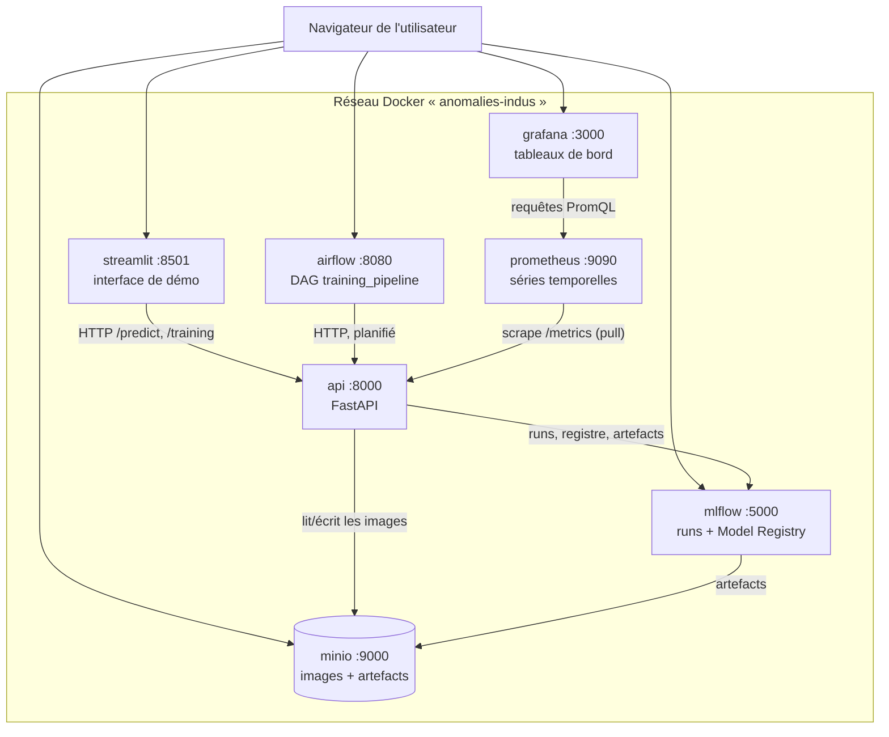
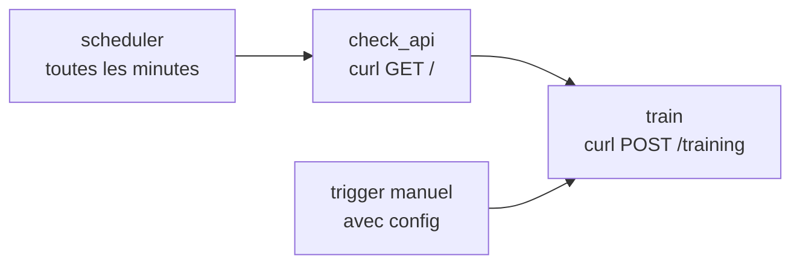

# Démo de soutenance — Anomalies Industrielles

> **À quoi sert ce fichier ?** Décrire précisément **ce que fait chaque service**,
> puis donner les **commandes à lancer dans l'ordre** pour une démonstration qui
> fonctionne. Les détails d'implémentation sont dans le `README.md`.

---

## 1. Le système en une image



**Le principe qui structure tout** : une seule logique métier (`core/`), exposée par
deux façades — la **CLI** (`scripts/`) et l'**API** — et consommée par une interface
qui ne fait qu'appeler l'API. Aucune logique ML n'est dupliquée nulle part.

| Service      | En une phrase                                                            | URL (hôte)                                         | Profil       |
| ------------ | ------------------------------------------------------------------------ | -------------------------------------------------- | ------------ |
| `minio`      | La **base de données d'images** (S3) + le stockage des artefacts MLflow  | http://localhost:9200 (console) · `:9100` (API S3) | cœur         |
| `mlflow`     | Le **suivi d'expériences** et le **Model Registry** (qui sert quoi)      | http://localhost:5050                              | cœur         |
| `api`        | Le **service de calcul** : entraîne (`/training`) et prédit (`/predict`) | http://localhost:8000/docs                         | cœur         |
| `streamlit`  | L'**interface de démonstration** (client HTTP de l'API)                  | http://localhost:8501                              | cœur         |
| `airflow`    | L'**orchestration** : déclenche l'entraînement automatiquement           | http://localhost:8080 (admin/admin)                | `airflow`    |
| `prometheus` | **Collecte** les métriques de l'API toutes les 15 s                      | http://localhost:9090                              | `monitoring` |
| `grafana`    | **Affiche** ces métriques (et les alertes)                               | http://localhost:3000                              | `monitoring` |

---

## 2. Chaque service en détail

### `minio` — object store S3 (les données)

**Ce qu'il fait exactement.** C'est un serveur S3 : il stocke des objets et les sert
en HTTP. Dans ce projet il joue deux rôles :

- **la base de données d'images** — bucket `mvtec-ad`, préfixe
  `raw/<catégorie>/<split>/<label>/<fichier>.png`, avec des _user metadata_ par objet
  (catégorie, split, label, `sha256`, dimensions) ;
- **le stockage des artefacts MLflow** — bucket `mlflow` (modèles `.npz`,
  `dataset_manifest.json`, `metadata.json`).

**Pourquoi c'est là.** Le dataset (5 354 images, ~4,9 Go) ne vit pas dans le dépôt :
il est interrogé par clé d'objet, et plusieurs modèles/versions peuvent le partager.

|            |                                                                                                                                                |
| ---------- | ---------------------------------------------------------------------------------------------------------------------------------------------- |
| Image      | `quay.io/minio/minio:RELEASE.2025-09-07T16-13-09Z` (MinIO n'est plus sur Docker Hub ; les builds 2026 exigent une licence ⇒ version AGPL 2025) |
| Ports hôte | `9100` → API S3 (9000 occupé par ailleurs), `9200` → console web                                                                               |
| Volume     | `./minio-data` (les **mêmes données** que le MinIO natif optionnel)                                                                            |
| Santé      | `GET /minio/health/live` (healthcheck Docker déclaré)                                                                                          |

**Si je le coupe** : `/training` échoue (pas d'images), MLflow ne peut plus écrire
d'artefacts, l'UI affiche des erreurs explicites au lieu de planter.

### `mlflow` — suivi d'expériences et Model Registry

**Ce qu'il fait exactement.** Serveur de tracking : il reçoit et expose les **runs**
(params, métriques, tags, artefacts) et gère le **Model Registry** (`padim-<catégorie>`
avec les alias `candidate` et `champion`). Ici, back-end **SQLite** (`mlflow.db`) et
artefacts dans MinIO — volontairement simple, sans Postgres.

**Ce qu'on y montre** :

- l'onglet _Runs_ : un run par entraînement, avec `auc`, `threshold`, `n_train`,
  `data_version`, `fraction`, **`git_commit`** ;
- l'onglet _Artifacts_ d'un run : `model/`, `metadata.json` et
  **`dataset_manifest.json`** (la liste des images utilisées) ;
- le _Model Registry_ : les versions de `padim-bottle`, leurs **tags de provenance**
  (`git_commit`, `dataset_sha256`) et les alias.

|              |                                                                                 |
| ------------ | ------------------------------------------------------------------------------- |
| Image        | `docker/mlflow/Dockerfile` (MLflow + boto3, car MLflow 3 n'a plus l'extra `s3`) |
| Port hôte    | `5050` → 5000 (5000 est pris par AirPlay Receiver sur macOS)                    |
| Volume       | `./mlflow.db` (l'historique survit aux redémarrages)                            |
| Piège traité | `--allowed-hosts` (sinon erreur _Invalid Host header_ / DNS rebinding)          |

**Si je le coupe** : l'API continue d'entraîner et de prédire (dégradation gracieuse
depuis `core/tracking.py`), mais plus de runs ni de promotion.

### `api` — le service de calcul

**Ce qu'il fait exactement.** FastAPI qui expose le code de `core/` — **le même code
que la CLI** (c'est ce qui garantit qu'une prédiction par l'UI, par l'API ou par le
script donne le même résultat).

| Endpoint             | Ce qu'il fait                                                                                                                                                                                    |
| -------------------- | ------------------------------------------------------------------------------------------------------------------------------------------------------------------------------------------------ |
| `GET /`              | infos + liste des endpoints (sert de sonde de disponibilité)                                                                                                                                     |
| `GET /models`        | catégories présentes dans MinIO + champion/candidate de chacune (AUC, seuil, commit, empreinte du dataset)                                                                                       |
| `GET /runs`          | derniers runs d'entraînement (métriques + traçabilité)                                                                                                                                           |
| `GET /data-versions` | la grille des versions de données : `v0` = 10 % … `v9` = 100 %                                                                                                                                   |
| `GET /metrics`       | métriques Prometheus (`http_*` automatiques + `anomalies_*` métier)                                                                                                                              |
| `POST /training`     | **entraîne** une catégorie : MinIO → features EfficientNet → gaussiennes par position → `.npz` local → run MLflow → **promotion du champion** si l'AUC le permet                                 |
| `POST /predict`      | **prédit** : charge le champion (cache `models/<cat>.champion.npz`, sinon téléchargement depuis le Registry) → score de Mahalanobis², seuil, verdict, et `heatmap=true` pour la carte d'anomalie |

Champs utiles de `POST /training` : `category`, `data_version` (0..9 ou `"full"`),
`fraction` (hors grille, ex. 0.37), `eval` (calcule l'AUC + le seuil Youbot… _seuil de
Youden_), `register` (créer une version au Registry), `promote` (autoriser la promotion).

|              |                                                                                                                                                                       |
| ------------ | --------------------------------------------------------------------------------------------------------------------------------------------------------------------- |
| Image        | `Dockerfile` racine (python:3.12-slim + TensorFlow, multi-arch)                                                                                                       |
| Port hôte    | `8000` (docs interactives sur `/docs`)                                                                                                                                |
| Volumes      | `./models` (cache du champion), `./dataset/raw` (lecture seule), `./.git` (**lecture seule** : commit du code dans les runs), `./datasets.json` (index de versioning) |
| Au démarrage | renseigne la jauge `anomalies_champion_auc` depuis le Registry (sinon le dashboard Grafana serait vide avant la 1ʳᵉ promotion)                                        |

**Si je le coupe** : l'UI Streamlit affiche « API injoignable » (elle ne plante pas),
Airflow met ses tâches en échec, Prometheus marque la cible `down`.

### `streamlit` — l'interface de démonstration

**Ce qu'elle fait exactement.** Cinq pages qui **appellent l'API en HTTP** : aucune
logique ML, aucun TensorFlow dans son image (d'où un démarrage en quelques secondes).

| Page                     | Ce qu'on y fait                                                                                                        |
| ------------------------ | ---------------------------------------------------------------------------------------------------------------------- |
| **Prédiction**           | choisir une image (téléversée ou prise dans le jeu de test) → verdict, score/seuil, et **carte d'anomalie superposée** |
| **Test par lot**         | enchaîner N images via `/predict` → tableau, taux de bonnes réponses, distribution des scores                          |
| **Entraînement**         | déclencher `POST /training` (part des données, éval, registre, promotion) et lire la décision de promotion             |
| **Modèle & traçabilité** | champion par catégorie (AUC, **commit du code**, **empreinte du dataset**) + derniers runs                             |
| **Monitoring**           | voyants des services, liens, métriques clés de `/metrics`                                                              |

|           |                                                                                                             |
| --------- | ----------------------------------------------------------------------------------------------------------- |
| Image     | `docker/streamlit/Dockerfile` (streamlit + requests + pandas, **sans TensorFlow**)                          |
| Port hôte | `8501`                                                                                                      |
| Volumes   | `./streamlit_app` (édition à chaud : Streamlit détecte le fichier modifié), `./dataset/raw` (lecture seule) |

### `airflow` — l'orchestration (profil `airflow`)

**Ce qu'il fait exactement.** Le DAG `training_pipeline` **ne contient aucune logique
ML** : ses deux tâches sont des appels HTTP.



- `check_api` : vérifie que l'API répond (échec rapide et lisible si la stack est incomplète) ;
- `train` : appelle `POST /training` avec les paramètres de `dag_run.conf`.

> **Le rythme et le contenu sont deux choses distinctes.** Le _scheduler_ décide
> **quand** : une exécution par minute (`TRAINING_SCHEDULE`). La **rampe** décide
> **quoi** : la version de données est déduite de la minute du run
> (`data_version = minute % 10`). Et `max_active_runs=1` décide **combien à la fois** :
> une seule — c'est ce qui donne l'effet « les unes à la suite des autres ».

|           |                                                                        |
| --------- | ---------------------------------------------------------------------- |
| Image     | `apache/airflow:2.10.5-python3.12` (Airflow 3 ne supporte plus SQLite) |
| Port hôte | `8080` — **admin / admin**                                             |
| Cadence   | `TRAINING_SCHEDULE` (`.env`), défaut `* * * * *`                       |
| Volume    | `airflow-home` (metadata SQLite + logs + pid files)                    |

**Le run planifié est volontairement léger** (`register: false`) : il ne crée que des
runs MLflow, sans téléverser l'artefact de 260 Mo — à 1 run/minute, ce serait ~15 Go/h
dans MinIO. **Et il change de jeu de données à chaque fois** : `data_version` suit une
**rampe** déduite de la minute du run (`minute % 10` → `v0`, `v1`, … `v9`, puis
reboucle). Dix entraînements différents au lieu du même rejoué en boucle, sans aucun
état à stocker et de façon rejouable. Pour un run **complet** (version au Registry +
promotion), on déclenche le DAG à la main avec une config — `dag_run.conf` a la priorité
sur la rampe.

**Durées** : 10 à 30 s selon la catégorie — toutes les images sont redimensionnées en
128×128, donc le coût suit le **nombre** d'images, pas leur résolution (mesuré :
`toothbrush` 60 images ≈ 10 s, `bottle` 209 → 12 s, `hazelnut` 391 + 110 images de test
→ 26 s). Le créneau d'une minute tient donc avec un facteur ~2. En cas de dépassement
(cache TensorFlow froid : ~2 min), le run suivant reste `queued` et démarre dès que la
place se libère — aucun échec, aucun cran sauté, juste un décalage.

### `prometheus` et `grafana` — le monitoring (profil `monitoring`)

**Ce qu'ils font exactement.** Prometheus _vient chercher_ (modèle « pull ») l'endpoint
`/metrics` de l'API toutes les 15 s et stocke l'historique ; Grafana interroge
Prometheus et affiche le tableau de bord. **Tout est provisionné depuis le dépôt** :
datasource, dashboard et règles d'alerte sont du code versionné, il n'y a rien à
cliquer après le démarrage.

Le tableau de bord surveille **deux niveaux** :

- **le service** : débit sur `/predict`, latence p95, erreurs 5xx ;
- **le modèle** : prédictions par verdict, score **rapporté au seuil**, AUC du
  champion, entraînements, promotions.

5 règles d'alerte sont chargées (API indisponible, latence, erreurs, part d'anomalies
inhabituelle, qualité du champion) — visibles dans l'onglet _Alerts_ de Prometheus.

|            |                                                                           |
| ---------- | ------------------------------------------------------------------------- |
| Images     | `prom/prometheus:v3.1.0`, `grafana/grafana:11.5.2`                        |
| Ports hôte | `9090` (Prometheus), `3000` (Grafana)                                     |
| Volumes    | `prometheus-data`, `grafana-data` + `./monitoring` monté en lecture seule |

---

## 3. Ce qui vit dans le dépôt (hors conteneurs)

| Élément          | Rôle                                                                                                                                                                                                          |
| ---------------- | ------------------------------------------------------------------------------------------------------------------------------------------------------------------------------------------------------------- |
| `core/`          | Le code partagé : `padim.py` (modèle), `padim_flavor.py` (pyfunc MLflow), `tracking.py` (runs/Registry/promotion), `versioning.py` (commit + manifeste), `metrics.py` (métriques), `config.py` + `storage.py` |
| `scripts/`       | Les CLI : `download_data.py`, `ingest_data.py`, `training.py`, `predict.py`, `lineage.py`, `setup_env.sh`, `reset_demo.sh`                                                                                    |
| `api/main.py`    | La façade HTTP (fine couche au-dessus de `core/`)                                                                                                                                                             |
| `streamlit_app/` | L'interface (client HTTP)                                                                                                                                                                                     |
| `airflow/dags/`  | Le DAG (code versionné, monté dans le conteneur)                                                                                                                                                              |
| `monitoring/`    | Configuration Prometheus + provisioning Grafana (**dashboards as code**)                                                                                                                                      |
| `datasets.json`  | L'index de **versioning des données** : empreinte → quoi, combien, quel dernier run (committé)                                                                                                                |
| `models/`        | Cache local des modèles (`<cat>.p30.npz` = 30 %) + champion téléchargé (non versionné)                                                                                                                        |
| `mlflow.db`      | Historique des runs MLflow (non versionné)                                                                                                                                                                    |

### Où va le modèle entraîné ? (les 4 emplacements)

Un entraînement écrit **toujours** un artefact local, quel que soit le déclencheur : CLI
`scripts/training.py`, `POST /training` depuis Streamlit, ou tâche `train` du DAG Airflow
(qui n'est qu'un `curl` sur `POST /training` — donc _le même code_) :

| #   | Emplacement                                      | Quand                                                                                |
| --- | ------------------------------------------------ | ------------------------------------------------------------------------------------ |
| 1   | `models/<cat>.p<NN>.npz` (bind-mount)            | **toujours** — `p30` = 30 % du train set, `bottle.npz` = 100 %                       |
| 2   | Artefacts du run MLflow (bucket `mlflow`)        | si `register: true` : modèle pyfunc + `metadata.json` + `dataset_manifest.json`      |
| 3   | Model Registry `padim-<cat>` (alias `candidate`) | si `register: true`, puis promotion automatique en `champion` si l'AUC ne baisse pas |
| 4   | `models/<cat>.champion.npz`                      | **paresseux** : téléchargé au premier `POST /predict` de la catégorie (cache)        |

> `register: false` (le défaut du run planifié) s'arrête à l'emplacement 1 : run MLflow +
> fichier local, **aucune** version au Registry. C'est ce qui permet de tourner chaque minute
> sans remplir MinIO (~260 Mo/run, soit ~15 Go/h).
>
> Corollaire : **le nom du fichier porte le pourcentage, pas le numéro de version** — un
> ré-entraînement à la même fraction **écrase** le même fichier (seul l'horodatage change).

**Savoir si le run a été promu** : le verdict est écrit **sur le run MLflow** lui-même
(`core.tracking.log_promotion`) — tags `promotion.promoted`, `promotion.reason`,
`promotion.candidate_score` vs `promotion.previous_champion_score`, artéfacts
`promotion.json` + `metadata.json`, et alias `champion` sur la version. Le log de la tâche
`train` (Airflow) montre le JSON complet, Grafana compte les promotions
(`anomalies_champion_promotions_total{category,promoted}`), Streamlit affiche une colonne
« promu », et `scripts/lineage.py` résume le verdict :

```
promotion      : 🏆 promue champion (champion précédent v12, AUC 0.9992)
promotion      : non promue — candidate moins bonne que le champion (0.7736 < 0.8566)
```

---

## 4. Commandes de démo, dans l'ordre

### Étape 0 — Préparation (une seule fois, hors démo)

```bash
./scripts/setup_env.sh                     # .env, dossiers, mlflow.db, datasets.json
python scripts/download_data.py            # dataset MVTec AD (~5 Go, Kaggle) — hors Docker
docker compose up -d --build               # 1er build : ~10-20 min selon le réseau
docker compose run --rm api python scripts/ingest_data.py --category bottle  # ~30 s
```

> `--category bottle` suffit pour une démo courte. Sans l'option : 4,9 Go, 5-10 min.

### Étape 1 — Démarrer la stack (≈1-2 min)

```bash
./stop_minio.sh                            # libère les ports 9100/9200 (MinIO natif)
docker compose up -d                       # démarre les 7 services d'un coup
```

> **Pourquoi une seule commande suffit** : `.env` contient
> `COMPOSE_PROFILES=airflow,monitoring`. Sans cette variable, `docker compose up -d`
> ne lancerait que le **cœur** (`minio`, `mlflow`, `api`, `streamlit`) — `airflow`,
> `prometheus` et `grafana` sont déclarés derrière des **profils Compose**, pour ne pas
> imposer ~2 Go d'images à qui veut seulement entraîner/prédire.
>
> ```bash
> docker compose up -d                      # les 7 (via COMPOSE_PROFILES du .env)
> docker compose --profile '*' up -d        # les 7 (joker, sans toucher au .env)
> COMPOSE_PROFILES= docker compose up -d    # le cœur seul (mode « minimal »)
> ```

> ℹ️ Comme `.env` active les profils, `docker compose down` arrête **et** supprime les
> 7 conteneurs : c'est ce qui évite l'erreur `network … not found` (voir §5).

### Étape 2 — Vérifier que tout répond (30 s, à faire AVANT la soutenance)

```bash
docker compose --profile airflow --profile monitoring ps
for p in 8000 8501 5050 8080 3000 9090; do
  printf '  %s : ' "$p"; curl -s -o /dev/null -w '%{http_code}\n' --max-time 5 localhost:$p/
done
```

Attendu : `200` (api), `200` (streamlit), `200` (mlflow), `302` (airflow), `200`
(grafana), `302` (prometheus) — et **7 services `Up`** (minio en `healthy`).

### Étape 3 — Le parcours de démonstration

#### 3.1 S'assurer qu'un champion existe (si la base est vide)

```bash
curl -s -X POST localhost:8000/training -H 'Content-Type: application/json' \
     -d '{"category":"bottle","data_version":9,"eval":true,"register":true}' \
  | python3 -m json.tool
```

→ `auc ≈ 0.9992`, un `mlflow_model_version`, et `mlflow_promotion.promoted: true`
(le premier run est forcément promu : il n'y a pas encore de champion).
_À dire :_ « l'entraînement part uniquement des images saines ; l'AUC sert à
promouvoir automatiquement le champion ».

> **État constaté au moment d'écrire ce fichier** (démo prête à l'emploi) :
> champion `bottle` **v15**, AUC 0,9992, 209 images (100 %), commit tracé, promu
> (tags `promotion.promoted: true`) ; `good/000.png` → **0,19×** le seuil (saine) ;
> `broken_large/000.png` → **8,89×** (ANOMALIE) ; lot de 8 `broken_large` → **8/8**
> détectées.

#### 3.2 Prédiction (Streamlit, http://localhost:8501)

| Action                                                                                      | Ce que dit le présentateur                                                                                    |
| ------------------------------------------------------------------------------------------- | ------------------------------------------------------------------------------------------------------------- |
| Onglet **Prédiction** → _Depuis le jeu de test_, type `good`, image `000.png` → **Prédire** | « une pièce saine : score 0,19× le seuil, verdict **saine** »                                                 |
| Changer le type en `broken_large`, image `000.png` → **Prédire**                            | « ici la cassure est détectée : 8,9× le seuil, **ANOMALIE** » + **carte d'anomalie** rouge sur la zone cassée |

Équivalent en ligne de commande (plan B si l'UI fait des siennes) :

```bash
docker compose exec api python scripts/predict.py --category bottle \
  --key raw/bottle/test/broken_large/000.png --heatmap /tmp/hm.png
```

#### 3.3 Test par lot (Streamlit)

Onglet **Test par lot** → type `broken_large`, 8 images → **Lancer**.
→ « 8/8 correctement classées » + tableau + distribution des scores (toutes au-dessus
du seuil).

#### 3.4 Entraînement et promotion (Streamlit)

| Action                                                                                    | Ce qu'on voit                                                                         |
| ----------------------------------------------------------------------------------------- | ------------------------------------------------------------------------------------- |
| Onglet **Entraînement** → `bottle`, `v2 — 30 %`, éval + registre + promotion → **Lancer** | AUC ≈ 0,997 → version enregistrée, **pas** de promotion (moins bonne que le champion) |
| Relancer avec `v9 — 100 %`                                                                | AUC ≈ 0,9992 → **« 🏆 Nouveau champion »**                                            |
| MLflow (http://localhost:5050) → le dernier run → onglet **Tags**                         | `promotion.promoted` + `promotion.reason` : le verdict est **tracé et filtrable**     |

_À dire :_ « la même commande est disponible en CLI et dans l'API : `--data-version` /
`data_version` ; la promotion est un **garde-fou automatique**, pas une décision
manuelle ».

#### 3.5 Traçabilité : quel code, quelles images ? (Streamlit + CLI)

Onglet **Modèle & traçabilité** → la ligne du champion montre `commit` + `dataset`.
Puis :

```bash
docker compose exec api python scripts/lineage.py --category bottle
```

→ version, `run MLflow`, **commit du code**, AUC, `data_version` (et le nombre
d'images), l'empreinte, et les premières images du manifeste.

_À dire :_ « depuis le modèle servi, je remonte au code et aux données exactes ;
chaque run porte un `dataset_manifest.json` qui liste ses images, et `datasets.json`
catalogue les jeux de données versionnés dans git ».

> Si le champion affiche `?` en face de `commit`, c'est qu'il a été entraîné **avant**
> la fonctionnalité de traçabilité (ni tag git, ni manifeste) : lance un run complet
> (§3.4, `v9 — 100 %` + registre) pour en promouvoir un tracé — à égalité d'AUC, la
> version la plus récente devient championne.

#### 3.6 Orchestration (Airflow, http://localhost:8080 — admin/admin)

```bash
docker compose exec airflow airflow dags unpause training_pipeline   # active la cadence
# … chaque minute : un cran de plus (v0 → v9) — visible dans l'UI Airflow et dans MLflow
docker compose exec airflow airflow dags pause training_pipeline     # à la fin !
```

Déclencher **un run complet** à la main (Registry + promotion) :

```bash
docker compose exec airflow airflow dags unpause training_pipeline   # ⚠️ indispensable
docker compose exec airflow airflow dags trigger training_pipeline \
  -c '{"category": "bottle", "data_version": 9, "eval": true, "register": true}'
docker compose exec airflow airflow dags pause training_pipeline     # refermer derrière soi
```

> ⚠️ Un run déclenché à la main sur un DAG **en pause** reste `queued` et ne s'exécute
> **jamais** : c'est le scheduler qui doit le prendre en charge. Dé-pause d'abord.

_À dire :_ « Airflow ne fait que de l'orchestration : ses tâches sont deux `curl`.
Le run planifié est volontairement allégé (`register: false`) pour ne pas écrire
260 Mo/minute — et il balaie la rampe de données : `v3`, `v4`, `v5`… dix entraînements
différents, pas le même rejoué en boucle. **La planification donne le rythme, la rampe
donne le contenu** : le _scheduler_ crée une exécution par minute, et chaque exécution
tire sa version de sa propre date logique (`minute % 10`) — dix crans balayés en dix
minutes, puis la boucle recommence. »

> ⚠️ **Remets le DAG en pause après la démo** : à 1 run/minute il réécrit un
> artefact local de 260 Mo à chaque fois.

#### 3.7 Monitoring (Grafana, http://localhost:3000)

Ouvrir le dossier **Anomalies Industrielles** → dashboard _Anomalies Industrielles — service & modèle_.
→ « à gauche la santé du service, à droite celle du modèle : verdicts, score/seuil,
AUC du champion, entraînements, promotions. Et 5 alertes sont armées dans
Prometheus. »

### Étape 4 — Si on te demande « et l'API ? » (bonus 1 min)

```bash
curl -s localhost:8000/ | python3 -m json.tool               # liste des endpoints
curl -s localhost:8000/models | python3 -m json.tool         # champion par catégorie
curl -s localhost:8000/data-versions | python3 -m json.tool  # grille 10 % → 100 %
```

Et les interfaces : **Swagger** http://localhost:8000/docs, **MLflow**
http://localhost:5050, **MinIO** http://localhost:9200 (`minioadmin` / `minioadmin`).

### Étape 5 — Arrêt / remise à zéro

```bash
# ⚠️ toujours arrêter AVEC les profils : sinon les conteneurs airflow/prometheus/
#    grafana survivent à l'arrêt, attachés à un réseau supprimé, et refusent de
#    redémarrer (voir §5).
docker compose --profile airflow --profile monitoring down
./scripts/reset_demo.sh                    # démo à blanc : vide runs/artefacts/modèles
./scripts/reset_demo.sh --full             # + vide aussi les images de MinIO
./scripts/reset_demo.sh --index            # + remet datasets.json à zéro
./scripts/reset_demo.sh --volumes          # + efface volumes Airflow/Grafana (destructif)
```

`reset_demo.sh` **déplace** (ne supprime jamais) vers `$BACKUP_ROOT` (défaut
`/tmp/anomalies-demo-backup`, chemin et taille imprimés à la fin). Sur macOS, `/tmp` étant
purgé au bout de ~3 jours, préférer un dossier durable pour une répétition :
`BACKUP_ROOT=~/demo-backups ./scripts/reset_demo.sh`.
Par défaut, `datasets.json` (index committé) et l'historique Airflow sont **conservés** :
`--index` et `--volumes` les remettent à zéro si tu veux un départ vraiment propre.

---

## 5. En cas de pépin (les pièges déjà rencontrés)

| Symptôme                                                     | Cause                                                                                                                           | Solution                                                                                                                                                              |
| ------------------------------------------------------------ | ------------------------------------------------------------------------------------------------------------------------------- | --------------------------------------------------------------------------------------------------------------------------------------------------------------------- |
| `pull access denied for minio/minio`                         | MinIO n'est plus publié sur Docker Hub                                                                                          | l'image vient de Quay (déjà configurée)                                                                                                                               |
| Port 5000 occupé                                             | **AirPlay Receiver** (macOS)                                                                                                    | l'UI MLflow est mappée sur `5050`                                                                                                                                     |
| `Invalid Host header` côté MLflow                            | protection DNS rebinding                                                                                                        | `--allowed-hosts` (déjà configuré)                                                                                                                                    |
| `failed to set up container networking: network … not found` | des conteneurs survivent à un `down` en référençant le réseau supprimé (cas où les profils ne sont **pas** activés dans `.env`) | relancer en activant les profils :<br/>`docker compose --profile airflow --profile monitoring down`<br/>`docker compose --profile airflow --profile monitoring up -d` |
| Un service ne répond pas juste après le `up` (`000`)         | démarrage normal : API ≈ 10-20 s (import TensorFlow), webserver Airflow ≈ 1 min                                                 | attendre et refaire la vérification de l'étape 2                                                                                                                      |
| Port 8080 muet, logs `Already running on PID …`              | pid files Airflow persistants dans le volume                                                                                    | `rm -f /opt/airflow/*.pid` (déjà dans la commande du service)                                                                                                         |
| `/training` → 500 au 1er appel, très lent                    | cache TensorFlow vide après un rebuild                                                                                          | normal : ~2-3 min une fois, puis 15-30 s                                                                                                                              |
| Le premier build est très long                               | téléchargement de TensorFlow                                                                                                    | cache pip persistant (déjà configuré)                                                                                                                                 |
| L'UI Streamlit ne montre pas mes modifications               | Streamlit exécute encore l'ancien code                                                                                          | bandeau _File change → Rerun_, ou `docker compose restart streamlit`                                                                                                  |
| Le DAG Airflow ne déclenche rien                             | il est **en pause**                                                                                                             | `docker compose exec airflow airflow dags unpause training_pipeline`                                                                                                  |
| Un run Airflow manuel reste `queued` indéfiniment            | un run déclenché à la main ne s'exécute que si le DAG est **actif**                                                             | dé-pauser **avant** de déclencher : `airflow dags unpause training_pipeline` (puis re-`pause`)                                                                        |
| On ne trouve pas le modèle dans `models/`                    | le fichier est nommé d'après le **pourcentage** (`cable.p40.npz`), pas d'après la version Registry                              | chercher `<cat>.p<NN>.npz` ; `cable.npz` n'existe que si entraîné à 100 %                                                                                             |
| Le champion affiche `?` en traçabilité                       | modèle entraîné avant la fonctionnalité de versioning                                                                           | lancer un run complet (§3.4, `v9 — 100 %` + registre)                                                                                                                 |
| Grafana : « No data » sur un panneau                         | compteurs remis à zéro au redémarrage de l'API                                                                                  | relancer une prédiction / un entraînement, ou attendre 15 s (scrape)                                                                                                  |

| Symptôme                                        | Cause                                          | Solution                                                             |
| ----------------------------------------------- | ---------------------------------------------- | -------------------------------------------------------------------- |
| `pull access denied for minio/minio`            | MinIO n'est plus sur Docker Hub                | l'image vient de Quay (déjà configurée)                              |
| Port 5000 occupé                                | **AirPlay Receiver** (macOS)                   | l'UI MLflow est mappée sur `5050`                                    |
| `Invalid Host header` côté MLflow               | protection DNS rebinding                       | `--allowed-hosts` (déjà configuré)                                   |
| Port 8080 muet, logs `Already running on PID …` | pid files Airflow persistants                  | `rm -f /opt/airflow/*.pid` au démarrage (déjà dans la commande)      |
| `/training` → 500 au 1er appel, très lent       | cache TensorFlow vide après un rebuild         | normal : ~2-3 min, puis 15-30 s                                      |
| Le premier build est très long                  | téléchargement de TensorFlow                   | cache pip persistant (déjà configuré)                                |
| L'UI Streamlit ne montre pas mes modifs         | Streamlit tourne sur l'ancien code             | bandeau _File change → Rerun_, ou `docker compose restart streamlit` |
| Le DAG Airflow ne déclenche rien                | il est **en pause**                            | `docker compose exec airflow airflow dags unpause training_pipeline` |
| Grafana : « No data » sur un panneau            | compteurs remis à zéro au redémarrage de l'API | relancer une prédiction / un entraînement, ou attendre 15 s (scrape) |
