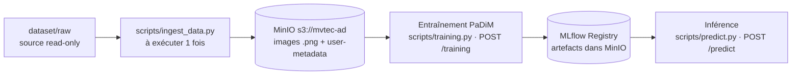

# avr26_bmle_mlops_anomaliesindus_test

Projet MLOps « Anomalies Indus » — mise en production d'un modèle de détection
d'anomalies industrielles (dataset [MVTec AD](https://www.mvtec.com/company/research/datasets/mvtec-ad)).

> La performance du modèle compte peu : l'objectif est de démontrer une
> **architecture MLOps** (données → entraînement → API → monitoring).

## État d'avancement

- [x] Base de données d'images (MinIO) + ingestion `scripts/ingest_data.py`
- [x] Entraînement PaDiM `scripts/training.py` (1 modèle/catégorie, versions de données simulées)
- [x] API FastAPI `api/main.py` — endpoints `/training` et `/predict`
- [x] Script de prédiction `scripts/predict.py` (CLI, heatmap, JSON)
- [x] Suivi d'expériences MLflow (params/métriques/artefacts dans MinIO)
- [x] Model Registry — PaDiM exposé en pyfunc, alias `candidate`/`champion`, promotion automatique
- [x] Inférence via le champion du Registry (cache local `models/`, repli hors-ligne)
- [x] Stack Docker Compose : `minio` + `mlflow` + `api`
- [ ] À venir : monitoring API, détection de dérive, orchestration du ré-entraînement

## Architecture des données

Le dataset vit dans un **object store S3 (MinIO)**, pas dans le repo :



- `dataset/raw/` : images MVTec AD d'origine (hors git — voir `.gitignore`).
- Les **métadonnées** (category, split, label, sha256, dimensions) sont stockées
  en _user metadata_ sur chaque objet MinIO. Une table SQL pourra être ajoutée
  plus tard sans ré-ingérer.

## Structure du projet

```
.
├── dataset/raw/        # source MVTec AD (hors git, read-only)
├── core/               # code partagé (package Python)
│   ├── config.py       #   lecture .env (endpoint, bucket, creds…)
│   ├── storage.py      #   client MinIO (get_client, ensure_bucket)
│   ├── padim.py        #   modèle PaDiM : fit/score, lecture MinIO
│   ├── padim_flavor.py #   PaDiM exposé comme modèle MLflow (pyfunc)
│   └── tracking.py     #   MLflow : runs, Registry, champion, promotion
├── scripts/            # scripts « métier » exécutables
│   ├── ingest_data.py  #   ingestion dataset -> MinIO (à exécuter 1 fois)
│   ├── training.py     #   entraînement PaDiM (1 catégorie -> models/*.npz)
│   └── predict.py      #   prédiction CLI (image locale ou clé MinIO)
├── api/
│   └── main.py         #   FastAPI : POST /training et POST /predict
├── docker/mlflow/
│   └── Dockerfile      #   image du serveur MLflow (tracking + registry)
├── Dockerfile          # image de l'API (FastAPI + TensorFlow)
├── docker-compose.yml  # stack locale : minio + mlflow + api
├── start_minio.sh      # (mode natif) démarre MinIO sur l'hôte
├── stop_minio.sh       # (mode natif) arrête MinIO
├── requirements.txt
├── .env / .env.example
├── .gitignore
└── README.md
```

Fichiers locaux **non versionnés** (voir `.gitignore`) :

- `minio-data/` — stockage MinIO (images MVTec + artefacts MLflow)
- `models/` — modèles PaDiM + cache du champion
- `mlflow.db` — backend store SQLite des runs

## Prérequis

- **Python 3.12** (TensorFlow ne supporte pas encore 3.14 ; le venv du projet est en 3.12)
- Un **serveur MinIO**, soit via **Docker** (voir « Démarrage avec Docker »), soit en **natif** (voir « Mode natif »)

> ⚠️ Sur cette machine, les ports 9000/9001 sont occupés par un kernel Jupyter :
> MinIO tourne donc sur **9100 (API S3)** / **9200 (console)**.

## Mode natif : lancer MinIO (sans Docker)

MinIO est un **serveur de stockage** : il doit tourner **avant** d'utiliser
`scripts/ingest_data.py`, qui s'y connecte ensuite sur `http://localhost:9100`.
(Si tu utilises Docker Compose, cette section est inutile.)

Installer la version libre (AGPL, sans licence) :

```bash
brew install minio/stable/minio
```

Démarrer / arrêter le serveur :

```bash
./start_minio.sh   # démarre le serveur en arrière-plan
./stop_minio.sh    # l'arrête
```

Après démarrage :

- API S3 (utilisée par les scripts) : http://localhost:9100
- Console web (interface) : http://localhost:9200 → `minioadmin` / `minioadmin`
- Vérification :
  `curl -s -o /dev/null -w "%{http_code}\n" http://localhost:9100/minio/health/live` → `200`

## Démarrage avec Docker (stack complète)

Alternative au mode natif : `docker compose` lance les 3 services.

```bash
./stop_minio.sh              # libérer les ports 9100/9200 et le dossier minio-data
docker compose up -d --build
docker compose logs -f api
docker compose down
```

| Service  | URL (hôte)                                                  | Rôle                              |
| -------- | ----------------------------------------------------------- | --------------------------------- |
| `api`    | http://localhost:8000/docs                                  | FastAPI (`/training`, `/predict`) |
| `minio`  | http://localhost:9200 (console) · `localhost:9100` (API S3) | images + artefacts                |
| `mlflow` | http://localhost:5050                                       | tracking + Model Registry         |

- Les conteneurs **réutilisent tes données** : `./minio-data` (images + artefacts),
  `./mlflow.db` (historique des runs) et `./models` (cache du champion).
- Dans le réseau Docker, MinIO est joignable via `minio:9000` et MLflow via
  `mlflow:5000` (voir `docker-compose.yml`).
- Lancer les CLI **dans** le conteneur (accès MinIO + serveur MLflow) :
  ```bash
  docker compose run --rm api python scripts/ingest_data.py --category bottle
  docker compose run --rm api python scripts/training.py --category bottle --eval --promote
  docker compose run --rm api python scripts/predict.py --category bottle --key raw/bottle/test/good/000.png
  ```
- **Multi-plateformes** : le même `Dockerfile` sert `linux/amd64`
  (Windows / Linux / Mac Intel) et `linux/arm64` (Apple Silicon) ; `requirements.txt`
  sélectionne le bon wheel TensorFlow selon l'architecture. Pour publier une image
  unique multi-arch sur Docker Hub :
  ```bash
  docker buildx build --platform linux/amd64,linux/arm64 \
    -t <user>/anomalies-indus:latest --push .
  ```

**Dépannage (rencontré puis résolu)**

- `pull access denied for minio/minio` → MinIO n'est **plus publié sur Docker Hub** :
  l'image vient de Quay (`quay.io/minio/minio:RELEASE.2025-09-07T16-13-09Z`, version
  AGPL 2025 — les builds 2026 exigent une licence).
- `/predict` → `500 … Invalid Host header (DNS rebinding)` → autoriser le nom de
  service Docker côté serveur MLflow :
  `--allowed-hosts mlflow,mlflow:5000,localhost,localhost:5050,127.0.0.1`.
- Port 5000 déjà occupé (macOS : **AirPlay Receiver**) → UI MLflow mappée sur
  `5050:5000`.
- Build interrompu ⇒ TensorFlow retéléchargé → les Dockerfiles utilisent un
  **cache pip persistant** (`--mount=type=cache`) et des timeouts tolérants.

## Vérifier que tout tourne bien dans Docker (et pas en local)

```bash
# 1) 3 conteneurs, leurs images et leurs ports
docker compose ps

# 2) l'hôte est macOS, le conteneur est un Linux -> on exécute bien une image
uname -a                                # Darwin ... arm64
docker compose exec -T api uname -a      # Linux ... aarch64 GNU/Linux

# 3) le PID 1 du conteneur EST le service
docker compose exec -T api sh -c 'tr "\0" " " < /proc/1/cmdline; echo'
#   -> /usr/local/bin/python3.12 /usr/local/bin/uvicorn api.main:app ...

# 4) rien ne tourne en local : le port est tenu par Docker
lsof -nP -iTCP:8000 -sTCP:LISTEN         # com.docker.backend (pas de python)
pgrep -fl uvicorn                        # aucun processus
python3 -c "import tensorflow"           # ModuleNotFoundError (TF est dans l'image)

# 5) les noms de services n'existent QUE dans le réseau Docker
docker compose exec -T api getent hosts minio mlflow   # 172.18.0.x
docker compose exec -T api curl -s -o /dev/null -w '%{http_code}\n' \
     http://minio:9000/minio/health/live                # 200
curl -s --max-time 5 http://minio:9000/minio/health/live  # échec : nom inconnu de l'hôte

# 6) test négatif : couper le conteneur coupe le service
docker compose stop api    # /predict devient injoignable (code pourtant présent sur l'hôte)
docker compose start api   # et repart aussitôt
```

**Ce que ça prouve** : le service ne dépend ni de Python, ni de TensorFlow, ni de MinIO
installés sur la machine — tout vit dans les images (`docker images` : `anomalies-indus-api`,
`anomalies-indus-mlflow`, `quay.io/minio/minio`).

## Démo à blanc (reset local)

Pour une démonstration « live » sans que les runs/modèles précédents interfèrent.
Rien n'est supprimé : tout est **déplacé** vers `/tmp/anomalies-demo-backup/<horodatage>`.

```bash
./scripts/reset_demo.sh            # garde les images MinIO, remet MLflow + modèles à zéro
./scripts/reset_demo.sh --full     # vide aussi le bucket des images (démo complète)
./scripts/reset_demo.sh --restore  # restaure la dernière sauvegarde
```

| Élément                                 | `reset_demo.sh` | `--full`      |
| --------------------------------------- | --------------- | ------------- |
| `minio-data/mlflow/` (artefacts MLflow) | vidé            | vidé          |
| `mlflow.db` (runs + Registry + alias)   | remis à zéro    | remis à zéro  |
| `models/` (modèles + cache champion)    | vidé            | vidé          |
| `minio-data/mvtec-ad/` (images)         | **conservé**    | vidé          |
| `dataset/raw/` (source)                 | jamais touché   | jamais touché |

Après un reset, `/predict` renvoie `404` (aucun modèle) : c'est l'état de départ idéal
pour démontrer `/training` → Registry → promotion → `/predict`.

## Ingestion

```bash
# 1. Environnement Python (une fois)
python3 -m venv .venv
source .venv/bin/activate
pip install -r requirements.txt

# 2. Configuration (une fois)
cp .env.example .env   # valeurs par défaut locales OK

# 3. Ingérer les images (serveur MinIO démarré, depuis la racine du projet)
python scripts/ingest_data.py --dry-run               # aperçu, rien n'est envoyé
python scripts/ingest_data.py                         # ingestion réelle (15 catégories)
python scripts/ingest_data.py --category bottle       # une seule catégorie (démo rapide)
python scripts/ingest_data.py --category bottle,tile  # plusieurs catégories
```

Le script est **idempotent** : le relancer ignore les objets déjà présents avec
le même hash SHA-256 (utile pour l'intégrer plus tard dans un pipeline planifié).

## Entraînement PaDiM (détection d'anomalies)

1 modèle par catégorie, approche non supervisée (uniquement les images `good`).

```bash
python scripts/training.py --category bottle --eval              # depuis MinIO (+ AUC)
python scripts/training.py --category bottle --data-version 1    # 40 % du corpus
python scripts/training.py --category screw  --fraction 0.5      # 50 % direct
python scripts/training.py --category screw --source local       # dossier local
```

**Versions de données simulées** (`data_version` = index 0..4 / `full`, grille
`[0.2, 0.4, 0.6, 0.8, 1.0]`) : on garde les _premiers_ images du corpus trié →
versions imbriquées simulant un dataset qui grandit dans le temps. Le hash
`dataset_sha256` change à chaque version → artefact et métriques différents
(ex. bottle : AUC 0.992 / 0.994 / 0.999). `full` = dataset complet et reproductible.

Artefacts : `models/<catégorie>.npz` (full), `.v<n>.npz` (version), `.f<nn>.npz`
(fraction) — mean + cov_inv + métadonnées. `models/` n'est pas versionné.

## Prédiction (CLI)

```bash
# Image locale
python scripts/predict.py --category bottle --image dataset/raw/bottle/test/good/000.png
# -> Verdict : OK

# Image depuis MinIO (clé d'objet)
python scripts/predict.py --category bottle --key raw/bottle/test/broken_large/000.png
# -> Verdict : ANOMALIE

# Sauver la heatmap d'anomalie + sortie JSON
python scripts/predict.py --category bottle \
  --image dataset/raw/bottle/test/broken_large/000.png \
  --heatmap /tmp/heat.png --json
```

Le modèle servi est le **champion du Registry MLflow** (téléchargé et mis en
cache dans `models/<catégorie>.champion.npz`) ; en cas d'indisponibilité du
Registry/MinIO, repli automatique sur les fichiers locaux `models/`.
Forcer le local : `--no-registry`. Sans seuil (entraînement sans `--eval`), seul
le score est affiché.

## Suivi MLflow

Chaque entraînement est enregistré dans MLflow : **params** (category,
data_version, fraction, img_size, ridge, n_features…), **métriques** (auc,
threshold, n_test, elapsed_s), **tags** (`dataset_sha256`) et l'**artefact** `.npz`.
Les artefacts sont rangés dans **MinIO** (bucket `mlflow`) ; les métadonnées des
runs dans un backend **SQLite** local (`mlflow.db`). Le dossier `models/` reste un
cache local (l'API en a besoin même si MLflow/MinIO est indisponible).

Configuration (`.env`) : `MLFLOW_TRACKING_URI` (vide ⇒ `sqlite:///mlflow.db`),
`MLFLOW_EXPERIMENT=anomalies-indus`, `MLFLOW_ARTIFACT_BUCKET=mlflow`.

> En **Docker**, le serveur MLflow tourne dans son conteneur : pour que des scripts
> lancés **côté hôte** écrivent dans ce même serveur, utiliser
> `MLFLOW_TRACKING_URI=http://localhost:5050`.

```bash
# un run MLflow par entraînement (nommé)
python scripts/training.py --category bottle --eval --run-name bottle-full

# désactiver MLflow ponctuellement
python scripts/training.py --category bottle --no-mlflow

# tracking seul (sans enregistrer dans le Registry)
python scripts/training.py --category bottle --no-register
```

Interface web (MinIO doit tourner pour afficher les artefacts) :

```bash
export MLFLOW_S3_ENDPOINT_URL=http://localhost:9100
export AWS_ACCESS_KEY_ID=minioadmin
export AWS_SECRET_ACCESS_KEY=minioadmin
mlflow ui --backend-store-uri sqlite:///mlflow.db --port 5050
# -> http://localhost:5050   (5000 est occupé par AirPlay Receiver sur macOS)
```

### Model Registry (PaDiM en pyfunc)

PaDiM n'étant pas un modèle scikit-learn/keras, il est exposé comme modèle MLflow
standard via un flavor **`pyfunc`** (`core/padim_flavor.py`, qui réutilise
`core/padim.py`). Chaque entraînement crée une **version** du registered model
`padim-<catégorie>` taguée `candidate` ; avec `--promote`, l'AUC est comparée à
celle du `champion` en place et la nouvelle version est promue si elle est meilleure.

```bash
# entraîne, enregistre une version, et promeut si meilleure
python scripts/training.py --category bottle --eval --run-name bottle-full --promote
```

```python
import mlflow
model = mlflow.pyfunc.load_model("models:/padim-bottle@champion")
model.predict([open("img.png", "rb").read()])   # -> score / threshold / anomaly
```

`POST /predict` et `scripts/predict.py` servent ce champion : au 1er appel il est
téléchargé depuis MinIO vers `models/<catégorie>.champion.npz` (+ fichier
`.version`) ; les appels suivants réutilisent le cache tant que la version n'a
pas changé. Le client expose l'origine via `model_source` (`registry`/`local`).

## API FastAPI

L'API expose l'entraînement et l'inférence en réutilisant `core.*` (le même code
que les scripts — anti train/serve skew). Un modèle doit exister (`/training` ou
`scripts/training.py`) avant de prédire.

```bash
# Démarrage en local (serveur MinIO allumé, venv activé)
uvicorn api.main:app --reload --port 8000
# Docs interactives : http://localhost:8000/docs

# En Docker, l'API est déjà exposée par `docker compose up -d` (même URL)
```

```bash
# Entraîner une catégorie (dataset complet + éval -> AUC + seuil stockés)
curl -X POST http://localhost:8000/training \
     -H "Content-Type: application/json" \
     -d '{"category": "bottle", "eval": true}'

# Version simulée : -d '{"category": "bottle", "data_version": 1}'

# Prédire une image (multipart)
curl -X POST http://localhost:8000/predict \
     -F "category=bottle" \
     -F "file=@dataset/raw/bottle/test/good/000.png"
# -> {"score": 7148290.0, "threshold": 38048944.0, "anomaly": false}
```

Exemple validé (`bottle`) : `/training` renvoie `auc = 0.9992` et un seuil de
`38 048 944` ; `/predict` renvoie `anomaly: false` sur une image saine et
`anomaly: true` sur une image `broken_large`.
