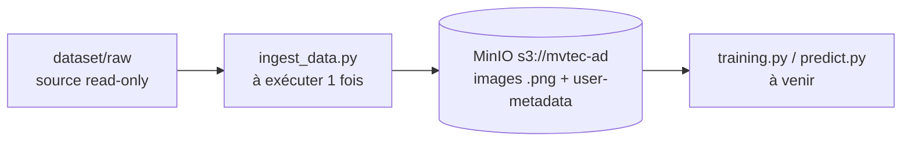

# avr26_bmle_mlops_anomaliesindus_test

Projet MLOps « Anomalies Indus » — mise en production d'un modèle de détection
d'anomalies industrielles (dataset [MVTec AD](https://www.mvtec.com/company/research/datasets/mvtec-ad)).

> La performance du modèle compte peu : l'objectif est de démontrer une
> **architecture MLOps** (données → entraînement → API → monitoring).

## État d'avancement

- [x] **Phase 1 — Fondations (début)** : base de données d'images (MinIO)
- [ ] Scripts `training.py` / `predict.py`
- [ ] API FastAPI (`/training`, `/predict`)

## Architecture des données

Le dataset vit dans un **object store S3 (MinIO)**, pas dans le repo :



- `dataset/raw/` : images MVTec AD d'origine (hors git — voir `.gitignore`).
- Les **métadonnées** (category, split, label, sha256, dimensions) sont stockées
  en _user metadata_ sur chaque objet MinIO. Une table SQL pourra être ajoutée
  plus tard sans ré-ingérer.

## Structure du projet

```
.
├── dataset/raw/        # source MVTec AD (hors git, read-only)
├── core/               # code partagé (package Python)
│   ├── config.py       #   lecture .env (endpoint, bucket, creds…)
│   └── storage.py      #   client MinIO (get_client, ensure_bucket)
├── scripts/            # scripts « métier » exécutables
│   ├── ingest_data.py  #   ingestion dataset -> MinIO (à exécuter 1 fois)
│   ├── training.py     #   (à venir)
│   └── predict.py      #   (à venir)
├── api/                # application FastAPI (à venir)
│   └── main.py         #   endpoints /training et /predict
├── start_minio.sh      # démarre le serveur MinIO local
├── stop_minio.sh       # arrête le serveur MinIO local
├── requirements.txt
├── .env / .env.example
├── .gitignore
└── README.md
```

## Prérequis

- Python 3.10+
- Serveur MinIO natif (Homebrew) — installation ci-dessous

> ⚠️ Sur cette machine, les ports 9000/9001 sont occupés par un kernel Jupyter :
> MinIO tourne donc sur **9100 (API S3)** / **9200 (console)**.

## Lancer le serveur MinIO

MinIO est un **serveur de stockage** : il doit tourner **avant** d'utiliser
`ingest_data.py`, qui s'y connecte ensuite sur `http://localhost:9100`.

Installer la version libre (AGPL, sans licence) :

```bash
brew install minio/stable/minio
```

Démarrer / arrêter le serveur :

```bash
./start_minio.sh   # démarre le serveur en arrière-plan
./stop_minio.sh    # l'arrête
```

Après démarrage :

- API S3 (utilisée par les scripts) : http://localhost:9100
- Console web (interface) : http://localhost:9200 → `minioadmin` / `minioadmin`
- Vérification :
  `curl -s -o /dev/null -w "%{http_code}\n" http://localhost:9100/minio/health/live` → `200`

## Ingestion

```bash
# 1. Environnement Python (une fois)
python3 -m venv .venv
source .venv/bin/activate
pip install -r requirements.txt

# 2. Configuration (une fois)
cp .env.example .env   # valeurs par défaut locales OK

# 3. Ingérer les images (serveur MinIO démarré, depuis la racine du projet)
python scripts/ingest_data.py --dry-run   # aperçu, rien n'est envoyé
python scripts/ingest_data.py             # ingestion réelle
```

Le script est **idempotent** : le relancer ignore les objets déjà présents avec
le même hash SHA-256 (utile pour l'intégrer plus tard dans un pipeline planifié).
