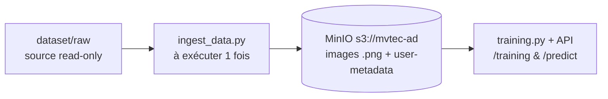

# avr26_bmle_mlops_anomaliesindus_test

Projet MLOps « Anomalies Indus » — mise en production d'un modèle de détection
d'anomalies industrielles (dataset [MVTec AD](https://www.mvtec.com/company/research/datasets/mvtec-ad)).

> La performance du modèle compte peu : l'objectif est de démontrer une
> **architecture MLOps** (données → entraînement → API → monitoring).

## État d'avancement

- [x] Base de données d'images (MinIO) + ingestion `scripts/ingest_data.py`
- [x] Entraînement PaDiM `scripts/training.py` (1 modèle/catégorie, versions simulées)
- [x] API FastAPI `api/main.py` — endpoints `/training` et `/predict`
- [ ] Script `predict.py` / Phase 2 (MLflow, monitoring…)

## Architecture des données

Le dataset vit dans un **object store S3 (MinIO)**, pas dans le repo :



- `dataset/raw/` : images MVTec AD d'origine (hors git — voir `.gitignore`).
- Les **métadonnées** (category, split, label, sha256, dimensions) sont stockées
  en _user metadata_ sur chaque objet MinIO. Une table SQL pourra être ajoutée
  plus tard sans ré-ingérer.

## Structure du projet

```
.
├── dataset/raw/        # source MVTec AD (hors git, read-only)
├── core/               # code partagé (package Python)
│   ├── config.py       #   lecture .env (endpoint, bucket, creds…)
│   ├── storage.py      #   client MinIO (get_client, ensure_bucket)
│   └── padim.py        #   modèle PaDiM : fit/score, lecture MinIO
├── scripts/            # scripts « métier » exécutables
│   ├── ingest_data.py  #   ingestion dataset -> MinIO (à exécuter 1 fois)
│   ├── training.py     #   entraînement PaDiM (1 catégorie -> models/*.npz)
│   └── predict.py      #   (à venir)
├── api/                # application FastAPI
│   └── main.py         #   endpoints POST /training et POST /predict
├── start_minio.sh      # démarre le serveur MinIO local
├── stop_minio.sh       # arrête le serveur MinIO local
├── requirements.txt
├── .env / .env.example
├── .gitignore
└── README.md
```

## Prérequis

- Python 3.10+
- Serveur MinIO natif (Homebrew) — installation ci-dessous

> ⚠️ Sur cette machine, les ports 9000/9001 sont occupés par un kernel Jupyter :
> MinIO tourne donc sur **9100 (API S3)** / **9200 (console)**.

## Lancer le serveur MinIO

MinIO est un **serveur de stockage** : il doit tourner **avant** d'utiliser
`ingest_data.py`, qui s'y connecte ensuite sur `http://localhost:9100`.

Installer la version libre (AGPL, sans licence) :

```bash
brew install minio/stable/minio
```

Démarrer / arrêter le serveur :

```bash
./start_minio.sh   # démarre le serveur en arrière-plan
./stop_minio.sh    # l'arrête
```

Après démarrage :

- API S3 (utilisée par les scripts) : http://localhost:9100
- Console web (interface) : http://localhost:9200 → `minioadmin` / `minioadmin`
- Vérification :
  `curl -s -o /dev/null -w "%{http_code}\n" http://localhost:9100/minio/health/live` → `200`

## Ingestion

```bash
# 1. Environnement Python (une fois)
python3 -m venv .venv
source .venv/bin/activate
pip install -r requirements.txt

# 2. Configuration (une fois)
cp .env.example .env   # valeurs par défaut locales OK

# 3. Ingérer les images (serveur MinIO démarré, depuis la racine du projet)
python scripts/ingest_data.py --dry-run   # aperçu, rien n'est envoyé
python scripts/ingest_data.py             # ingestion réelle
```

Le script est **idempotent** : le relancer ignore les objets déjà présents avec
le même hash SHA-256 (utile pour l'intégrer plus tard dans un pipeline planifié).

## Entraînement PaDiM (détection d'anomalies)

1 modèle par catégorie, approche non supervisée (uniquement les images `good`).

```bash
python scripts/training.py --category bottle --eval              # depuis MinIO (+ AUC)
python scripts/training.py --category bottle --data-version 1    # 40 % du corpus
python scripts/training.py --category screw  --fraction 0.5      # 50 % direct
python scripts/training.py --category screw --source local       # dossier local
```

**Versions de données simulées** (`data_version` = index 0..4 / `full`, grille
`[0.2, 0.4, 0.6, 0.8, 1.0]`) : on garde les _premiers_ images du corpus trié →
versions imbriquées simulant un dataset qui grandit dans le temps. Le hash
`dataset_sha256` change à chaque version → artefact et métriques différents
(ex. bottle : AUC 0.992 / 0.994 / 0.999). `full` = dataset complet et reproductible.

Artefacts : `models/<catégorie>.npz` (full), `.v<n>.npz` (version), `.f<nn>.npz`
(fraction) — mean + cov_inv + métadonnées. `models/` n'est pas versionné.

## API FastAPI

L'API expose l'entraînement et l'inférence en réutilisant `core.*` (le même code
que les scripts — anti train/serve skew). Un modèle doit exister (`/training` ou
`scripts/training.py`) avant de prédire.

```bash
# Démarrage (depuis la racine, serveur MinIO allumé)
uvicorn api.main:app --reload --port 8000
# Docs interactives : http://localhost:8000/docs
```

```bash
# Entraîner une catégorie (dataset complet + éval -> AUC + seuil stockés)
curl -X POST http://localhost:8000/training \
     -H "Content-Type: application/json" \
     -d '{"category": "bottle", "eval": true}'

# Version simulée : -d '{"category": "bottle", "data_version": 1}'

# Prédire une image (multipart)
curl -X POST http://localhost:8000/predict \
     -F "category=bottle" -F "file=@/tmp/good.png"
# -> {"score": 7148290.0, "threshold": 38048944.0, "anomaly": false}
```

Exemple validé (`bottle`) : `/training` renvoie `auc = 0.9992` et un seuil de
`38 048 944` ; `/predict` renvoie `anomaly: false` sur une image saine et
`anomaly: true` sur une image `broken_large`.
