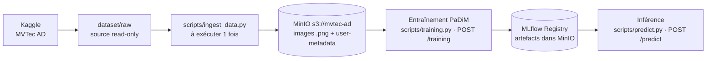
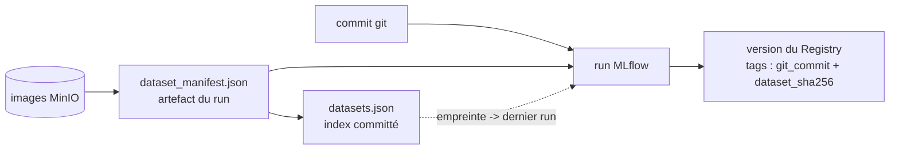
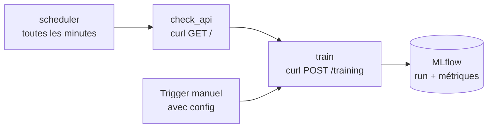
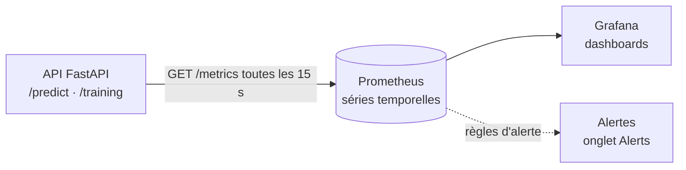

# avr26_bmle_mlops_anomaliesindus_test

Projet MLOps « Anomalies Indus » — mise en production d'un modèle de détection
d'anomalies industrielles (dataset [MVTec AD](https://www.mvtec.com/company/research/datasets/mvtec-ad)).

> La performance du modèle compte peu : l'objectif est de démontrer une
> **architecture MLOps** (données → entraînement → API → monitoring).

## État d'avancement

- [x] Récupération du dataset MVTec AD depuis Kaggle (`scripts/download_data.py`)
- [x] Base de données d'images (MinIO) + ingestion `scripts/ingest_data.py`
- [x] Entraînement PaDiM `scripts/training.py` (1 modèle/catégorie, versions de données simulées)
- [x] API FastAPI `api/main.py` — `/training`, `/predict`, `/models`, `/runs`, `/data-versions`, `/metrics`
- [x] Script de prédiction `scripts/predict.py` (CLI, heatmap, JSON)
- [x] Suivi d'expériences MLflow (params/métriques/artefacts dans MinIO)
- [x] Model Registry — PaDiM exposé en pyfunc, alias `candidate`/`champion`, promotion automatique
- [x] Inférence via le champion du Registry (cache local `models/`, repli hors-ligne)
- [x] Stack Docker Compose : `minio` + `mlflow` + `api`
- [x] Orchestration Airflow (profil `airflow`) : DAG planifié qui déclenche `/training`
- [x] Monitoring Prometheus + Grafana (profil `monitoring`) : `/metrics`, dashboards, alertes
- [x] Versioning code + données : commit git par run, manifeste des images, index `datasets.json`
- [x] Interface de démonstration Streamlit (client HTTP de l'API, carte d'anomalie)
- [ ] À venir : détection de dérive des données (comparaison de distributions)

## Architecture des données

Le dataset vit dans un **object store S3 (MinIO)**, pas dans le repo :



- `dataset/raw/` : images MVTec AD d'origine (hors git — voir `.gitignore`).
- Les **métadonnées** (category, split, label, sha256, dimensions) sont stockées
  en _user metadata_ sur chaque objet MinIO. Une table SQL pourra être ajoutée
  plus tard sans ré-ingérer.

## Structure du projet

```
.
├── dataset/raw/        # source MVTec AD (hors git, read-only)
├── core/               # code partagé (package Python)
│   ├── config.py       #   lecture .env (endpoint, bucket, creds…)
│   ├── storage.py      #   client MinIO (get_client, ensure_bucket)
│   ├── padim.py        #   modèle PaDiM : fit/score, lecture MinIO
│   ├── metrics.py      #   métriques Prometheus (service + modèle)
│   ├── padim_flavor.py #   PaDiM exposé comme modèle MLflow (pyfunc)
│   ├── tracking.py     #   MLflow : runs, Registry, champion, promotion
│   └── versioning.py   #   traçabilité : commit git + manifeste du dataset
├── scripts/            # scripts « métier » exécutables
│   ├── download_data.py #  récupération du dataset MVTec AD (Kaggle) -> dataset/raw
│   ├── ingest_data.py  #   ingestion dataset -> MinIO (à exécuter 1 fois)
│   ├── training.py     #   entraînement PaDiM (1 catégorie -> models/*.npz)
│   ├── lineage.py      #   traçabilité d'un modèle (code + images)
│   ├── predict.py      #   prédiction CLI (image locale ou clé MinIO)
│   └── reset_demo.sh   #   remise à zéro pour une démo « live »
├── api/
│   └── main.py         #   FastAPI : /training, /predict, /models, /runs, /metrics
├── streamlit_app/
│   ├── app.py          #   interface de démonstration (5 pages)
│   └── api_client.py   #   client HTTP de l'API (aucune logique ML)
├── airflow/dags/
│   └── training_pipeline.py # DAG Airflow : appelle POST /training (planifié)
├── monitoring/
│   ├── prometheus/     #   prometheus.yml (collecte) + alerts.yml (règles)
│   └── grafana/        #   provisioning + dashboard (dashboards as code)
├── docker/mlflow/
│   └── Dockerfile      #   image du serveur MLflow (tracking + registry)
├── docker/streamlit/
│   ├── Dockerfile      #   image de l'UI (client HTTP, sans TensorFlow)
│   └── requirements.txt
├── Dockerfile          # image de l'API (FastAPI + TensorFlow)
├── docker-compose.yml  # stack : minio + mlflow + api (+ airflow/monitoring via profils)
├── start_minio.sh      # (mode natif) démarre MinIO sur l'hôte
├── stop_minio.sh       # (mode natif) arrête MinIO
├── requirements.txt
├── .env / .env.example
├── .gitignore
├── DEMO.md             # runbook de démo (services + commandes dans l'ordre)
└── README.md
```

Fichiers locaux **non versionnés** (voir `.gitignore`) :

- `minio-data/` — stockage MinIO (images MVTec + artefacts MLflow)
- `models/` — modèles PaDiM + cache du champion
- `mlflow.db` — backend store SQLite des runs

À l'inverse, `datasets.json` **est** committé : c'est l'index du versioning des
données (voir la section Versioning).

## Démarrage rapide (nouveau clone)

Après un `git clone`, les données, la config et les artefacts manquent (tous ignorés par git).

```bash
# 1. Config + dossiers (.env, dataset/raw/, models/, mlflow.db)
./scripts/setup_env.sh

# 2. Dataset MVTec AD (~5 Go) — côté hôte :
pip install kaggle && kaggle auth login
python scripts/download_data.py
#    … ou 100 % Docker (identifiants Kaggle requis) :
# docker run --rm -v "$PWD/dataset:/app/dataset" -v "$HOME/.kaggle:/root/.kaggle:ro" \
#   -w /app anomalies-indus-api python scripts/download_data.py --dest /app/dataset/raw

# 3. Construire + démarrer la stack (1er build : compter ~10-20 min selon le réseau)
docker compose up -d --build

# 4. Ingérer les images (--category pour aller vite ; sans : ~4,9 Go, 5-10 min)
docker compose run --rm api python scripts/ingest_data.py --category bottle

# 5. Entraîner (promotion automatique du champion)
docker compose run --rm api python scripts/training.py --category bottle --eval

# 6. Prédire
curl -X POST localhost:8000/predict \
     -F category=bottle -F file=@dataset/raw/bottle/test/good/000.png
# -> {"model_source":"registry","anomaly":false}
```

| Interface                | URL                        |
| ------------------------ | -------------------------- |
| API (Swagger)            | http://localhost:8000/docs |
| MLflow (runs + Registry) | http://localhost:5050      |
| MinIO (console)          | http://localhost:9200      |

**Sans compte Kaggle** : `dataset/raw/` doit contenir `<catégorie>/{train/good,test}` —
tu peux aussi télécharger l'archive depuis la page Kaggle et l'extraire dedans.

> Prérequis : Docker Desktop **démarré**. Si `docker compose up` est lancé avant
> `setup_env.sh`, Docker crée un **dossier** `mlflow.db` → supprime-le et relance le script.

## Prérequis

- **Python 3.12** (TensorFlow ne supporte pas encore 3.14 ; le venv du projet est en 3.12)
- Un **serveur MinIO**, soit via **Docker** (voir « Démarrage avec Docker »), soit en **natif** (voir « Mode natif »)

> ⚠️ Sur cette machine, les ports 9000/9001 sont occupés par un kernel Jupyter :
> MinIO tourne donc sur **9100 (API S3)** / **9200 (console)**.

## Mode natif : lancer MinIO (sans Docker)

MinIO est un **serveur de stockage** : il doit tourner **avant** d'utiliser
`scripts/ingest_data.py`, qui s'y connecte ensuite sur `http://localhost:9100`.
(Si tu utilises Docker Compose, cette section est inutile.)

Installer la version libre (AGPL, sans licence) :

```bash
brew install minio/stable/minio
```

Démarrer / arrêter le serveur :

```bash
./start_minio.sh   # démarre le serveur en arrière-plan
./stop_minio.sh    # l'arrête
```

Après démarrage :

- API S3 (utilisée par les scripts) : http://localhost:9100
- Console web (interface) : http://localhost:9200 → `minioadmin` / `minioadmin`
- Vérification :
  `curl -s -o /dev/null -w "%{http_code}\n" http://localhost:9100/minio/health/live` → `200`

## Démarrage avec Docker (stack complète)

> **Pour une démonstration pas à pas** — ce que fait chaque service + l'ordre exact
> des commandes : voir [`DEMO.md`](DEMO.md).

Alternative au mode natif : `docker compose` lance le cœur applicatif
(`airflow` et `monitoring` sont optionnels, derrière des profils : voir les sections
Orchestration et Monitoring).

```bash
./stop_minio.sh                           # libérer les ports 9100/9200 et le dossier minio-data
docker compose up -d --build
docker compose --profile airflow up -d     # optionnel : + orchestration
docker compose --profile monitoring up -d  # optionnel : + Prometheus/Grafana
docker compose logs -f api
# ⚠️ arrêter AVEC les profils (sinon leurs conteneurs gardent une référence au
#    réseau supprimé et refusent de redémarrer : « network … not found »)
docker compose --profile airflow --profile monitoring down
```

- **Profils Compose** : `airflow` et `monitoring` sont déclarés derrière des profils,
  pour ne pas imposer ~2 Go d'images et ~1 min de démarrage à qui veut seulement
  entraîner/prédire. `.env` active les deux (`COMPOSE_PROFILES=airflow,monitoring`),
  donc `docker compose up -d` démarre **les 7 services** ; pour le cœur seul :
  `COMPOSE_PROFILES= docker compose up -d` (ou ponctuellement
  `docker compose --profile '*' up -d` pour tout activer sans toucher au `.env`).

| Service      | URL (hôte)                                                  | Rôle                                                              |
| ------------ | ----------------------------------------------------------- | ----------------------------------------------------------------- |
| `api`        | http://localhost:8000/docs                                  | FastAPI (`/training`, `/predict`, `/models`, `/runs`, `/metrics`) |
| `streamlit`  | http://localhost:8501                                       | interface de démonstration                                        |
| `minio`      | http://localhost:9200 (console) · `localhost:9100` (API S3) | images + artefacts                                                |
| `mlflow`     | http://localhost:5050                                       | tracking + Model Registry                                         |
| `airflow`    | http://localhost:8080 (profil `airflow`, admin/admin)       | orchestration du ré-entraînement                                  |
| `prometheus` | http://localhost:9090 (profil `monitoring`)                 | collecte des métriques                                            |
| `grafana`    | http://localhost:3000 (profil `monitoring`, admin/admin)    | tableaux de bord et alertes                                       |

- Les conteneurs **réutilisent tes données** : `./minio-data` (images + artefacts),
  `./mlflow.db` (historique des runs) et `./models` (cache du champion).
- Dans le réseau Docker, MinIO est joignable via `minio:9000` et MLflow via
  `mlflow:5000` (voir `docker-compose.yml`).
- Lancer les CLI **dans** le conteneur (accès MinIO + serveur MLflow) :
  ```bash
  docker compose run --rm api python scripts/ingest_data.py --category bottle
  docker compose run --rm api python scripts/training.py --category bottle --eval
  docker compose run --rm api python scripts/predict.py --category bottle --key raw/bottle/test/good/000.png
  ```
- **Multi-plateformes** : le même `Dockerfile` sert `linux/amd64`
  (Windows / Linux / Mac Intel) et `linux/arm64` (Apple Silicon) ; `requirements.txt`
  sélectionne le bon wheel TensorFlow selon l'architecture. Pour publier une image
  unique multi-arch sur Docker Hub :
  ```bash
  docker buildx build --platform linux/amd64,linux/arm64 \
    -t <user>/anomalies-indus:latest --push .
  ```

**Dépannage (rencontré puis résolu)**

- `pull access denied for minio/minio` → MinIO n'est **plus publié sur Docker Hub** :
  l'image vient de Quay (`quay.io/minio/minio:RELEASE.2025-09-07T16-13-09Z`, version
  AGPL 2025 — les builds 2026 exigent une licence).
- `/predict` → `500 … Invalid Host header (DNS rebinding)` → autoriser le nom de
  service Docker côté serveur MLflow :
  `--allowed-hosts mlflow,mlflow:5000,localhost,localhost:5050,127.0.0.1`.
- Port 5000 déjà occupé (macOS : **AirPlay Receiver**) → UI MLflow mappée sur
  `5050:5000`.
- Build interrompu ⇒ TensorFlow retéléchargé → les Dockerfiles utilisent un
  **cache pip persistant** (`--mount=type=cache`) et des timeouts tolérants.
- `failed to set up container networking: network … not found` après un
  `docker compose down` sans profils : les conteneurs `airflow`/`prometheus`/`grafana`
  survivent en référençant le réseau supprimé. Relancer avec les profils :
  `docker compose --profile airflow --profile monitoring down` puis `… up -d`.

## Vérifier que tout tourne bien dans Docker (et pas en local)

```bash
# 1) les conteneurs du cœur applicatif (minio + mlflow + api)
#    --profile airflow / --profile monitoring en ajoutent d'autres
docker compose ps

# 2) l'hôte est macOS, le conteneur est un Linux -> on exécute bien une image
uname -a                                # Darwin ... arm64
docker compose exec -T api uname -a      # Linux ... aarch64 GNU/Linux

# 3) le PID 1 du conteneur EST le service
docker compose exec -T api sh -c 'tr "\0" " " < /proc/1/cmdline; echo'
#   -> /usr/local/bin/python3.12 /usr/local/bin/uvicorn api.main:app ...

# 4) rien ne tourne en local : le port est tenu par Docker
lsof -nP -iTCP:8000 -sTCP:LISTEN         # com.docker.backend (pas de python)
pgrep -fl uvicorn                        # aucun processus
python3 -c "import tensorflow"           # ModuleNotFoundError (TF est dans l'image)

# 5) les noms de services n'existent QUE dans le réseau Docker
docker compose exec -T api getent hosts minio mlflow   # 172.18.0.x
docker compose exec -T api curl -s -o /dev/null -w '%{http_code}\n' \
     http://minio:9000/minio/health/live                # 200
curl -s --max-time 5 http://minio:9000/minio/health/live  # échec : nom inconnu de l'hôte

# 6) test négatif : couper le conteneur coupe le service
docker compose stop api    # /predict devient injoignable (code pourtant présent sur l'hôte)
docker compose start api   # et repart aussitôt
```

**Ce que ça prouve** : le service ne dépend ni de Python, ni de TensorFlow, ni de MinIO
installés sur la machine — tout vit dans les images (`docker images` : `anomalies-indus-api`,
`anomalies-indus-mlflow`, `quay.io/minio/minio`).

## Démo à blanc (reset local)

Pour une démonstration « live » sans que les runs/modèles précédents interfèrent.
Rien n'est supprimé : tout est **déplacé** vers `/tmp/anomalies-demo-backup/<horodatage>`.

```bash
./scripts/reset_demo.sh            # garde les images MinIO, remet MLflow + modèles à zéro
./scripts/reset_demo.sh --full     # vide aussi le bucket des images (démo complète)
./scripts/reset_demo.sh --restore  # restaure la dernière sauvegarde
```

| Élément                                 | `reset_demo.sh` | `--full`      |
| --------------------------------------- | --------------- | ------------- |
| `minio-data/mlflow/` (artefacts MLflow) | vidé            | vidé          |
| `mlflow.db` (runs + Registry + alias)   | remis à zéro    | remis à zéro  |
| `models/` (modèles + cache champion)    | vidé            | vidé          |
| `minio-data/mvtec-ad/` (images)         | **conservé**    | vidé          |
| `dataset/raw/` (source)                 | jamais touché   | jamais touché |

Après un reset, `/predict` renvoie `404` (aucun modèle) : c'est l'état de départ idéal
pour démontrer `/training` → Registry → promotion → `/predict`.

## Récupérer le dataset (Kaggle)

Étape 0 : télécharge MVTec AD et le range dans `dataset/raw/<catégorie>/`.
À lancer **sur l'hôte** (`dataset/raw` est monté en lecture seule dans le conteneur `api`).

Authentification Kaggle — au choix :

```bash
kaggle auth login                        # recommandé (OAuth)
# ou : export KAGGLE_API_TOKEN=...       # https://www.kaggle.com/settings/api
# ou : ~/.kaggle/kaggle.json  (chmod 600)
```

```bash
python scripts/download_data.py                # télécharge + range
python scripts/download_data.py --dry-run      # plan seulement (ne modifie rien)
python scripts/download_data.py --force        # remplace les catégories existantes
python scripts/download_data.py --from-dir /chemin/vers/zip/extrait
```

Le script détecte les 15 dossiers de catégories quelle que soit l'arborescence du
zip (un dossier « catégorie » = `train/good/` + `test/`) et est **idempotent** :
les catégories déjà présentes sont ignorées. Le dataset (~5 Go) n'est pas versionné.

## Ingestion

```bash
# 1. Environnement Python (une fois)
python3 -m venv .venv
source .venv/bin/activate
pip install -r requirements.txt

# 2. Configuration (une fois)
cp .env.example .env   # valeurs par défaut locales OK

# 3. Ingérer les images (serveur MinIO démarré, depuis la racine du projet)
python scripts/ingest_data.py --dry-run               # aperçu, rien n'est envoyé
python scripts/ingest_data.py                         # ingestion réelle (15 catégories)
python scripts/ingest_data.py --category bottle       # une seule catégorie (démo rapide)
python scripts/ingest_data.py --category bottle,tile  # plusieurs catégories
```

Le script est **idempotent** : le relancer ignore les objets déjà présents avec
le même hash SHA-256 (utile pour l'intégrer plus tard dans un pipeline planifié).

## Entraînement PaDiM (détection d'anomalies)

1 modèle par catégorie, approche non supervisée (uniquement les images `good`).

```bash
python scripts/training.py --category bottle --eval              # depuis MinIO (+ AUC)
python scripts/training.py --category bottle --data-version 2    # 30 % du corpus
python scripts/training.py --category screw  --fraction 0.5      # 50 % direct (hors grille)
python scripts/training.py --category screw --source local       # dossier local
```

**Versions de données simulées** : la grille `DATA_VERSION_FRACTIONS` avance par
**pas de 10 %** → `data_version` = index `0..9` (ou `'full'`) : `v0` = 10 %, `v1` = 20 %,
… `v9` = 100 %. On garde les _premiers_ images du corpus trié → versions imbriquées
simulant un dataset qui grandit dans le temps. Le hash `dataset_sha256` change à
chaque version → artefact et métriques différents (ex. bottle : AUC 0.992 à 20 %,
0.997 à 30 %, 0.999 à 100 %).

```bash
# la grille exacte est exposée par l'API (et affichée par l'interface Streamlit)
curl -s localhost:8000/data-versions
```

Artefacts : `models/<catégorie>.npz` pour 100 %, sinon
`models/<catégorie>.p<percent>.npz` (ex. `bottle.p30.npz` = 30 %) — mean + cov_inv +
métadonnées. Le pourcentage est **explicite dans le nom** et ne dépend pas de l'index
de la grille (la changer ne « renumérote » donc pas les modèles existants).
`models/` n'est pas versionné.

## Prédiction (CLI)

```bash
# Image locale
python scripts/predict.py --category bottle --image dataset/raw/bottle/test/good/000.png
# -> Verdict : OK

# Image depuis MinIO (clé d'objet)
python scripts/predict.py --category bottle --key raw/bottle/test/broken_large/000.png
# -> Verdict : ANOMALIE

# Sauver la heatmap d'anomalie + sortie JSON
python scripts/predict.py --category bottle \
  --image dataset/raw/bottle/test/broken_large/000.png \
  --heatmap /tmp/heat.png --json
```

Le modèle servi est le **champion du Registry MLflow** (téléchargé et mis en
cache dans `models/<catégorie>.champion.npz`) ; en cas d'indisponibilité du
Registry/MinIO, repli automatique sur les fichiers locaux `models/`.
Forcer le local : `--no-registry`. Sans seuil (entraînement sans `--eval`), seul
le score est affiché.

## Suivi MLflow

Chaque entraînement est enregistré dans MLflow : **params** (category,
data_version, fraction, img_size, ridge, n_features…), **métriques** (auc,
threshold, n_test, elapsed_s), **tags** (`dataset_sha256`) et l'**artefact** `.npz`.
Les artefacts sont rangés dans **MinIO** (bucket `mlflow`) ; les métadonnées des
runs dans un backend **SQLite** local (`mlflow.db`). Le dossier `models/` reste un
cache local (l'API en a besoin même si MLflow/MinIO est indisponible).

Configuration (`.env`) : `MLFLOW_TRACKING_URI` (vide ⇒ `sqlite:///mlflow.db`),
`MLFLOW_EXPERIMENT=anomalies-indus`, `MLFLOW_ARTIFACT_BUCKET=mlflow`.

> En **Docker**, le serveur MLflow tourne dans son conteneur : pour que des scripts
> lancés **côté hôte** écrivent dans ce même serveur, utiliser
> `MLFLOW_TRACKING_URI=http://localhost:5050`.

```bash
# un run MLflow par entraînement (nommé)
python scripts/training.py --category bottle --eval --run-name bottle-full

# désactiver MLflow ponctuellement
python scripts/training.py --category bottle --no-mlflow

# tracking seul (sans enregistrer dans le Registry)
python scripts/training.py --category bottle --no-register
```

Interface web (MinIO doit tourner pour afficher les artefacts) :

```bash
export MLFLOW_S3_ENDPOINT_URL=http://localhost:9100
export AWS_ACCESS_KEY_ID=minioadmin
export AWS_SECRET_ACCESS_KEY=minioadmin
mlflow ui --backend-store-uri sqlite:///mlflow.db --port 5050
# -> http://localhost:5050   (5000 est occupé par AirPlay Receiver sur macOS)
```

### Model Registry (PaDiM en pyfunc)

PaDiM n'étant pas un modèle scikit-learn/keras, il est exposé comme modèle MLflow
standard via un flavor **`pyfunc`** (`core/padim_flavor.py`, qui réutilise
`core/padim.py`). Chaque entraînement crée une **version** du registered model
`padim-<catégorie>` taguée `candidate`, puis **promue automatiquement** en `champion`
si son AUC est au moins égale à celle du champion en place (à égalité, la version la
plus récente devient championne). Nécessite `--eval` ; `--no-promote` pour désactiver.

```bash
# entraîne, enregistre une version, et promeut automatiquement si meilleure
python scripts/training.py --category bottle --eval --run-name bottle-full

# ne pas toucher au champion :
python scripts/training.py --category bottle --eval --no-promote
```

```python
import mlflow
model = mlflow.pyfunc.load_model("models:/padim-bottle@champion")
model.predict([open("img.png", "rb").read()])   # -> score / threshold / anomaly
```

`POST /predict` et `scripts/predict.py` servent ce champion : au 1er appel il est
téléchargé depuis MinIO vers `models/<catégorie>.champion.npz` (+ fichier
`.version`) ; les appels suivants réutilisent le cache tant que la version n'a
pas changé. Le client expose l'origine via `model_source` (`registry`/`local`).

### Où le modèle est-il écrit ?

| Emplacement                                           | Condition                                                                                        |
| ----------------------------------------------------- | ------------------------------------------------------------------------------------------------ |
| `models/<cat>.p<NN>.npz` (bind-mount `./models`)      | **toujours** — le nom porte le **pourcentage** du train set (`p30` = 30 %), pas le n° de version |
| Artefacts du run MLflow (bucket MinIO `mlflow`)       | `register: true` (CLI : défaut) — pyfunc + `metadata.json` + `dataset_manifest.json`             |
| Version du Registry `padim-<cat>` (alias `candidate`) | `register: true` **et** `--eval` — puis promotion automatique en `champion`                      |
| `models/<cat>.champion.npz`                           | **paresseux** — au premier `/predict` de la catégorie (cache)                                    |

Les trois déclencheurs (CLI, `POST /training`, tâche `train` du DAG Airflow — qui n'est
qu'un `curl` sur `POST /training`) passent par le même `core/` : l'artefact local est
donc écrit **dans tous les cas**, seule la partie Registry dépend de `register`.

> Le fichier local est nommé d'après la **fraction**, pas d'après la version : un
> ré-entraînement à la même fraction **écrase** le fichier (l'horodatage change), et
> `bottle.npz` (sans suffixe) n'existe que pour un entraînement à **100 %**.

### Suivre la promotion d'un modèle

`promote_if_better()` est appelé **après** `log_training()` (le run est donc déjà
fermé) : le verdict est ré-écrit sur le run par `log_promotion()`, sinon il ne vivrait
que dans la réponse HTTP de `POST /training`.

| Où                               | Ce qu'on y voit                                                                                                                      |
| -------------------------------- | ------------------------------------------------------------------------------------------------------------------------------------ |
| MLflow → run → onglet **Tags**   | `promotion.promoted`, `promotion.reason`, `promotion.candidate_version` / `_score`, `promotion.previous_champion_version` / `_score` |
| MLflow → run → **Artifacts**     | `promotion.json` (verdict complet) + `metadata.json` (ré-écrit avec `mlflow_promotion`)                                              |
| MLflow → Models → la version     | alias : `champion` **et** `candidate` = promue ; `candidate` seul = non promue                                                       |
| Airflow → tâche `train` → log    | la réponse JSON de `POST /training` (le `curl` du DAG n'est pas muet)                                                                |
| Grafana / Prometheus             | `anomalies_champion_promotions_total{category, promoted}`                                                                            |
| Streamlit → Modèle & traçabilité | colonne « promu » du tableau des runs (🏆 oui / non / —)                                                                             |

```python
import mlflow
mlflow.search_runs(filter_string="tags.promotion.promoted = 'true'")   # les runs promus
```

> `scripts/lineage.py` résume le verdict quand tu remontes depuis le champion :
> `promotion : 🏆 promue champion (champion précédent v12, AUC 0.9992)`, ou
> `non promue — candidate moins bonne que le champion (0.7736 < 0.8566)`.

## API FastAPI

L'API expose l'entraînement et l'inférence en réutilisant `core.*` (le même code
que les scripts — anti train/serve skew). Un modèle doit exister (`/training` ou
`scripts/training.py`) avant de prédire.

```bash
# Démarrage en local (serveur MinIO allumé, venv activé)
uvicorn api.main:app --reload --port 8000
# Docs interactives : http://localhost:8000/docs

# En Docker, l'API est déjà exposée par `docker compose up -d` (même URL)
```

```bash
# Entraîner une catégorie (dataset complet + éval -> AUC + seuil stockés)
curl -X POST http://localhost:8000/training \
     -H "Content-Type: application/json" \
     -d '{"category": "bottle", "eval": true}'

# Version de données : -d '{"category": "bottle", "data_version": 2}'  # 30 % (voir /data-versions)

# Prédire une image (multipart)
curl -X POST http://localhost:8000/predict \
     -F "category=bottle" \
     -F "file=@dataset/raw/bottle/test/good/000.png"
# -> {"score": 7148290.0, "threshold": 38048944.0, "anomaly": false}
```

Exemple validé (`bottle`) : `/training` renvoie `auc = 0.9992` et un seuil de
`38 048 944` ; `/predict` renvoie `anomaly: false` sur une image saine et
`anomaly: true` sur une image `broken_large`.

## Interface de démonstration (Streamlit)

Objectif : rendre la démonstration confortable **sans dupliquer de logique ML**.
L'application est un **client HTTP de l'API** (`streamlit_app/api_client.py`) : elle
n'importe ni `core`, ni TensorFlow. Conséquences : image légère et démarrage en
quelques secondes, rendu strictement identique à la CLI et à l'API, et si l'API est
arrêtée l'interface l'affiche au lieu de planter.

```bash
docker compose up -d            # streamlit fait partie du cœur applicatif
# UI : http://localhost:8501
```

| Page                     | Ce qu'elle montre                                                                                                    |
| ------------------------ | -------------------------------------------------------------------------------------------------------------------- |
| **Prédiction**           | une image (téléversée ou choisie dans le jeu de test) → verdict, score/seuil et **carte d'anomalie superposée**      |
| **Test par lot**         | N images enchaînées via `/predict` → tableau, taux de bonnes réponses, distribution des scores                       |
| **Entraînement**         | déclenche `POST /training` (version de données, évaluation, registre, promotion) et affiche la décision de promotion |
| **Modèle & traçabilité** | champion par catégorie (AUC, commit du code, empreinte du dataset) et derniers runs                                  |
| **Monitoring**           | voyants des services, liens MLflow/Grafana/Airflow/MinIO, métriques clés de `/metrics`                               |

Pour rendre ces pages possibles sans embarquer MLflow côté interface, trois endpoints
ont été ajoutés à l'API :

| Endpoint                     | Contenu                                                                                                    |
| ---------------------------- | ---------------------------------------------------------------------------------------------------------- |
| `GET /models`                | catégories présentes dans MinIO + champion/candidate de chacune (AUC, seuil, commit, empreinte du dataset) |
| `GET /runs`                  | derniers runs d'entraînement (métriques + traçabilité)                                                     |
| `GET /data-versions`         | grille des versions de données (`v0` = 10 % … `v9` = 100 %) — alimente le formulaire d'entraînement        |
| `POST /predict?heatmap=true` | ajoute `heatmap_png` (carte d'anomalie superposée, PNG base64)                                             |

Le rendu de la carte (`core.padim.anomaly_overlay`) est **partagé** avec
`scripts/predict.py --heatmap` : un seul code, donc un seul rendu possible.

`./streamlit_app` est monté en volume : on peut modifier une page et la recharger
sans reconstruire l'image (Streamlit détecte le changement de fichier).

Lancer l'interface hors Docker (venv + `pip install streamlit requests`) :

```bash
API_BASE_URL=http://localhost:8000 streamlit run streamlit_app/app.py
```

## Versioning (code + données)

Deux questions à pouvoir trancher à tout moment, sur le modèle servi :

1. **quel code** l'a produit ?
2. **quelles images** ont servi à son entraînement ?

Pas de DVC ici : les images restent la source de vérité dans MinIO, et on versionne
la **recette** (sélection) et le **contenu exact** (liste des images) de chaque run.



### 1. Le commit du code (`core/versioning.py`)

Chaque run porte le commit dans ses **params** (`git_commit`, `git_branch`,
`git_dirty`), dans ses **tags**, et sur la **version du Registry**. Résolution en
cascade :

| Source                 | Contexte   | Remarque                                                              |
| ---------------------- | ---------- | --------------------------------------------------------------------- |
| variable `GIT_COMMIT`  | CI / build | prioritaire (stamp de build)                                          |
| `git rev-parse`        | hôte       | donne aussi `git_dirty` (modifs non commitées)                        |
| lecture de `.git/HEAD` | conteneur  | pas de binaire git dans l'image : `./.git` est monté en lecture seule |

`git_dirty` reste inconnu dans le conteneur (aucun binaire git) : c'est la seule
limite, et elle est assumée. Le reste — commit, branche — est exact.

### 2. Le manifeste des images

`dataset_manifest.json` est un **artefact du run** (rangé par MLflow dans MinIO) :
c'est la correspondance **run -> images**.

```json
{
  "dataset_sha256": "e9f44bc1558326561331c73c4c3c3f453bef890a0ffa2bbcc3e8b32624a6d09f",
  "fingerprint_matches": true,
  "selection": {
    "data_version": 0,
    "fraction": 0.201,
    "n_images": 42,
    "total_available": 209
  },
  "code": { "commit": "48e801a35028", "branch": "main", "source": "dot-git" },
  "images": [
    {
      "id": "raw/bottle/train/good/000.png",
      "size": 532823,
      "etag": "55573ccce4c8…"
    }
  ]
}
```

La sélection est **rejouée à l'identique** (les sous-ensembles `data_version` sont
déterministes), puis l'empreinte est recalculée et comparée à celle de
l'entraînement : `fingerprint_matches: false` signalerait que le dataset a bougé
entre les deux. Aucune image n'est copiée ni dupliquée.

### 3. L'index `datasets.json` (committé)

C'est le « fichier de matching » : une empreinte de dataset -> ce qu'elle contient et
le dernier run qui l'a utilisée. Il vit **dans git** (donc versionné) sans contenir
une seule image :

```json
"cd7bfe456678898a23b29aea358c6f44452b5fc0a5f30e059f471db5f6a8877c": {
  "category": "bottle", "n_images": 63, "total_available": 209,
  "source": "s3://mvtec-ad/raw/bottle/train/good/",
  "selection": {"data_version": 2, "fraction": 0.3014},
  "runs": {"count": 1, "last_run_id": "f1c8c836e0684a15a13470aaa82736ba"}
}
```

Il n'est mis à jour que pour les runs qui **enregistrent une version de modèle** :
sinon les runs planifiés d'Airflow (un par minute) réécriraient le fichier en boucle
sans rien apporter.

### 4. Remonter la chaîne

```bash
python scripts/lineage.py --category bottle                            # alias champion
python scripts/lineage.py --category bottle --alias candidate --images # toute la liste
```

```
padim-bottle @candidate  ->  version 11
  run MLflow     : f1c8c836e0684a15a13470aaa82736ba
  commit du code : df0074a1fa9d
  AUC            : 0.9968
  data_version   : 2 (63 images d'entraînement)
  dataset_sha256 : cd7bfe456678898a23b29aea358c6f44452b5fc0a5f30e059f471db5f6a8877c
  index du repo  : 63 images sur 209 disponibles, 1 run(s) enregistrés
                   source : s3://mvtec-ad/raw/bottle/train/good/
  manifeste      : 63 images (empreinte recalculée cohérente : True)
      - raw/bottle/train/good/000.png  (532823 o, etag 55573ccce4c8)
      - raw/bottle/train/good/001.png  (531263 o, etag 34b8d2965839)
      - raw/bottle/train/good/002.png  (541084 o, etag 3bff91aa1212)
      … et 60 autres images (--images pour tout afficher)
```

Les runs **antérieurs** à cette fonctionnalité affichent `?` / « manifeste
indisponible » (le script ne plante pas) : la traçabilité est rétro-compatible,
mais évidemment incomplète pour l'historique.

### Piège rencontré (et résolu)

- Dans le conteneur, `datasets.json` est un **bind mount** : `os.replace()` vers un
  point de montage échoue (`EBUSY — Device or resource busy`). L'écriture est donc
  atomique _quand c'est possible_, sinon en place — acceptable car l'index est un
  fichier **dérivé** : les runs MLflow et leurs manifestes restent la source de
  vérité.

## Orchestration (Airflow)

Objectif volontairement simple : **montrer qu'un entraînement peut être déclenché
automatiquement**, à intervalle régulier, sans intervention manuelle. Airflow
n'exécute aucune logique de ML — le DAG appelle l'API, qui reste la seule source de
vérité (découplage total orchestration / compute, et image Airflow sans TensorFlow).

```bash
docker compose --profile airflow up -d
# UI : http://localhost:8080      (admin / admin)
# DAG : training_pipeline, actif et planifié toutes les minutes
```

Le profil `airflow` évite d'imposer l'image (~1,5 Go) et ~1 min de démarrage à qui
veut seulement l'API : `docker compose up -d` reste la stack applicative minimale.

### Le DAG : `airflow/dags/training_pipeline.py`



| Élément          | Valeur                                                                                  |
| ---------------- | --------------------------------------------------------------------------------------- |
| Planification    | `TRAINING_SCHEDULE` (`.env`, défaut `* * * * *` = chaque minute)                        |
| Concurrence      | `max_active_runs=1`, `catchup=False`                                                    |
| Version du run   | **rampe** : `data_version` = minute du run logique % `DATA_LADDER_STEPS` (v0 → v9 → v0) |
| Paramètres fixes | `category: bottle`, `eval: true`, `register: false`                                     |
| Surcharge        | `dag_run.conf` (« Trigger DAG w/ config »), **prioritaire** sur la rampe                |

- **La rampe de données** : les runs planifiés ne rejouent pas 10 fois le même
  entraînement, ils balaient le jeu cumulatif (`v0` = 10 % → `v9` = 100 %) cran par
  cran. La version est déduite de la **minute du run logique** : aucun état à stocker,
  comportement **déterministe** (rejouable), et la séquence reboucle (`v0 → v9 → v0`)
  tant que le DAG est actif. Pour démarrer la démo à `v0`, dé-pauser juste avant une
  minute en `0` (`14:29:40` → premier run `14:30`).
- **Les runs planifiés sont légers** (`register: false`) : le DAG ne crée que les
  runs MLflow et leurs métriques. À 1 run/min, enregistrer l'artefact (~260 Mo par
  modèle) produirait ~15 Go/heure dans MinIO.
- Un run planifié dure **10 à 30 s selon la catégorie** — mesuré : `toothbrush`
  (60 images) ≈ 10 s, `bottle` (209) 12 s, `hazelnut` (391 + 110 images de test) 26 s.
  Toutes les images étant redimensionnées en 128×128, le coût suit le **nombre**
  d'images, pas leur résolution. Le créneau d'une minute est donc tenu avec un facteur
  ~2, en réécrivant à chaque fois le `.npz` local de ~260 Mo dans `models/`.
- Si un entraînement dépasse la minute, `max_active_runs=1` fait patienter le suivant :
  le run est créé au créneau prévu mais reste `queued` jusqu'à libération de la place
  (aucun run perdu, aucun cran de la rampe sauté — juste un décalage). Le tout premier
  appel après une reconstruction de l'image `api` est bien plus long (~2-3 min) :
  TensorFlow retélécharge les poids Keras dans le conteneur.
- **La promotion du champion se déclenche à la demande**, en passant d'autres
  paramètres dans la config du run :

  ```json
  { "category": "bottle", "data_version": 9, "eval": true, "register": true }
  ```

  La réponse de `/training` (AUC, version registrée, décision de promotion) s'affiche
  dans le **log de la tâche `train`**.

### Cycle complet (la démonstration « champion »)

```bash
# 1. Une version moins bonne (20 % des données) -> promue ? non
#    (garde-fou : la promotion n'a lieu que si l'AUC est >= celle du champion)
# 2. Le dataset complet -> promotion en 'champion'
docker compose exec airflow airflow dags trigger training_pipeline \
     -c '{"category": "bottle", "data_version": 9, "eval": true, "register": true}'
```

### Choix de simplicité assumés

- Metadata DB **SQLite** dans le volume `airflow-home` : l'historique des runs
  Airflow survit à `docker compose down` (mais pas à `down -v`). En production :
  Postgres + `LocalExecutor` dédiés.
- `SequentialExecutor` : une tâche à la fois — suffisant ici (une seule tâche métier),
  à remplacer pour de la vraie concurrence.
- Airflow n'est **pas** dans `requirements.txt` : il vit uniquement dans son conteneur,
  aucune dépendance Airflow côté hôte ni côté API.

### Dépannage (rencontré puis résolu)

- Webserver muet (port 8080 → `000`) après un redémarrage, avec dans les logs
  `Error: Already running on PID … (or pid file … is stale)` → les fichiers `.pid`
  persistent dans le volume `airflow-home` et bloquent le démarrage suivant. C'est
  nettoyé automatiquement (`rm -f /opt/airflow/*.pid` dans la `command:` du service).
- La `command:` du service doit tenir sur **une seule ligne** : dans un `bash -c "…"`
  multi-ligne, chaque retour à la ligne coupe la commande et le conteneur sort en
  boucle (`--firstname: command not found`).
- `airflow dags list`, `dags test`, `tasks test` fonctionnent **sans** le webserver :
  pratique pour valider un DAG pendant que l'UI démarre (~1 min).

### Arrêter ou ralentir l'automatisation

```bash
# mettre le DAG en pause (l'historique et l'UI restent consultables)
docker compose exec airflow airflow dags pause training_pipeline

# … ou changer la cadence pour la prochaine session : TRAINING_SCHEDULE=@daily dans .env
#     puis  docker compose --profile airflow up -d airflow
```

## Monitoring (Prometheus + Grafana)

**À quoi ça sert ?** MLflow répond à _« quel modèle est le meilleur ? »_ (historique,
comparaison d'expériences). Le monitoring répond à _« comment se comporte le système
maintenant ? »_ — la question de la mise en production : est-ce que ça répond, est-ce
que ça répond vite, et **est-ce que ce que le modèle prédit a encore du sens ?**

| Outil          | Rôle                                                                                                                    | Analogie                                      |
| -------------- | ----------------------------------------------------------------------------------------------------------------------- | --------------------------------------------- |
| **Prometheus** | Collecte et stocke des séries temporelles. Il _vient chercher_ (modèle « pull ») l'endpoint `/metrics` toutes les 15 s. | la base de données des chiffres dans le temps |
| **Grafana**    | Interroge Prometheus et dessine courbes, jauges et alertes.                                                             | l'écran du tableau de bord                    |



```bash
docker compose --profile monitoring up -d
# Grafana    : http://localhost:3000  (admin/admin ; accès anonyme en lecture pour la démo)
# Prometheus : http://localhost:9090  (onglets Targets et Alerts pour déboguer)
```

### Ce qui est exposé

L'API expose `GET /metrics`. Deux familles de métriques :

| Métrique                                                 | Type                  | Ce qu'elle raconte                                                      |
| -------------------------------------------------------- | --------------------- | ----------------------------------------------------------------------- |
| `http_requests_total`, `http_request_duration_seconds`   | compteur, histogramme | débit, latence et codes de statut (instrumentation FastAPI automatique) |
| `anomalies_predictions_total{category,verdict}`          | compteur              | combien de pièces jugées saines / défectueuses                          |
| `anomalies_prediction_score_ratio{category}`             | jauge                 | dernier score **rapporté au seuil** (1.0 = pile le seuil)               |
| `anomalies_prediction_score{category}`                   | histogramme           | distribution des distances de Mahalanobis²                              |
| `anomalies_trainings_total{category,status}`             | compteur              | entraînements déclenchés (succès et échecs)                             |
| `anomalies_training_duration_seconds{category}`          | histogramme           | durée des entraînements                                                 |
| `anomalies_champion_auc{category}`                       | jauge                 | AUC du modèle effectivement servi (lu dans le Registry au démarrage)    |
| `anomalies_champion_promotions_total{category,promoted}` | compteur              | décisions de promotion (promu / refusé)                                 |

Les métriques `anomalies_*` sont définies dans `core/metrics.py` (avec la logique
métier) ; les `http_*` viennent de `prometheus-fastapi-instrumentator`. Si la librairie
est absente, les helpers deviennent des no-ops et l'API continue de tourner — même
logique de dégradation gracieuse que `core/tracking.py`.

`anomalies_prediction_score_ratio` est volontairement un **rapport** : les scores de
Mahalanobis² n'ont pas la même échelle d'une catégorie à l'autre (1e6 à 1e9), donc
comparer des ratios est le seul moyen d'avoir un indicateur lisible et comparable.

### Le tableau de bord

Provisionné automatiquement (« dashboards as code ») depuis
`monitoring/grafana/dashboards/anomalies-indus.json` : **aucun clic** après un
`docker compose up`, et le dashboard est versionné avec le reste du code.

- **Service** : débit sur `/predict`, latence p95, erreurs 5xx.
- **Modèle** : prédictions par verdict (le ratio anomalie/normal est le premier signal
  de dérive), score rapporté au seuil, AUC du champion, entraînements et promotions.

Pour la démonstration : lancer quelques `curl /predict`, lancer un `/training`, puis
activer le DAG Airflow (`airflow dags unpause training_pipeline`) — les courbes se
remplissent en direct.

### Les alertes

`monitoring/prometheus/alerts.yml` définit 5 règles, visibles dans l'onglet **Alerts**
de Prometheus et dans Grafana :

| Alerte                      | Condition                              | Ce qu'elle signifie                      |
| --------------------------- | -------------------------------------- | ---------------------------------------- |
| `ApiIndisponible`           | `up == 0` pendant 1 min                | l'API ne répond plus                     |
| `LatencePredictElevee`      | p95 de `/predict` > 1 s pendant 5 min  | l'inférence est trop lente               |
| `ErreursServeur`            | plus de 0,1 erreur 5xx/s pendant 5 min | des requêtes échouent                    |
| `PartAnomaliesInhabituelle` | plus de 50 % d'anomalies pendant 5 min | dérive des données **ou** seuil inadapté |
| `QualiteChampionFaible`     | `anomalies_champion_auc < 0.90`        | le modèle servi est de mauvaise qualité  |

Il n'y a **pas d'Alertmanager** : choix assumé pour garder la stack légère. Les alertes
sont donc visibles mais n'envoient ni e-mail ni webhook. L'étape suivante naturelle est
d'ajouter un Alertmanager dont le webhook déclenche le DAG Airflow de ré-entraînement,
ce qui fermerait la boucle MLOps : dérive détectée → ré-entraînement → promotion du
champion → monitoring.

### Points d'attention (rencontrés puis résolus)

- L'instrumentation FastAPI regroupe les statuts en classes (`2xx`, `5xx`) et non en
  codes bruts : écrire `status="5xx"`, pas `status="500"`.
- `increase(counter[fenêtre])` ne voit que les **variations** : le premier événement
  d'un processus (déjà compté au premier scrape) est invisible. Pour une démo, afficher
  le compteur cumulé est plus parlant.
- `histogram_quantile()` renvoie `NaN` tant qu'un histogramme n'a pas 2 points dans la
  fenêtre. Pour des événements rares (un entraînement par heure), préférer la moyenne
  `_sum / _count`, robuste dès la première observation.
- Un compteur vide donne `No data` et non `0` : écrire `... or vector(0)` dans le panneau.
